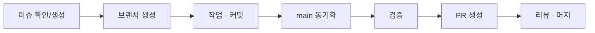

# Contributing

이 프로젝트에 기여해 주셔서 감사합니다. 아래 내용은 팀 내부 협업과 외부 기여 모두에 적용됩니다.

---

## 시작하기

1. [README — 설치 방법](README.md#10-설치-방법)에 따라 로컬 환경을 구성합니다.
2. [docs/Development.md](docs/Development.md)에서 개발 규약을 확인합니다.
3. 아래 절차에 따라 작업합니다.

---

## 작업 절차



### 1. 이슈

작업 전 이슈를 생성하거나 기존 이슈를 확인합니다. 중복 작업을 방지하고 논의 맥락을 남기기 위함입니다.

- 버그: [Bug Report 템플릿](.github/ISSUE_TEMPLATE/bug_report.md)
- 기능 제안: [Feature Request 템플릿](.github/ISSUE_TEMPLATE/feature_request.md)

### 2. 브랜치

```bash
git checkout main
git pull origin main
git checkout -b feature/기능명
```

| 접두사 | 용도 |
|---|---|
| `feature/` | 새 기능 |
| `fix/` | 버그 수정 |
| `docs/` | 문서 |
| `refactor/` | 구조 개선 |

### 3. 커밋

[docs/Development.md — 커밋 컨벤션](docs/Development.md#4-커밋-컨벤션)을 따릅니다.

```
feat: 대여 신청 취소 API 추가
fix: 재고 0일 때 승인이 차단되지 않던 문제 수정
docs: API 명세에 반납 엔드포인트 추가
```

한 커밋에는 한 종류의 변경만 담습니다.

### 4. 검증

PR 생성 전 아래를 확인합니다.

**백엔드**

```bash
cd backend
python -c "import ast, glob; [ast.parse(open(f, encoding='utf-8').read(), f) for f in glob.glob('app/**/*.py', recursive=True)]"
uvicorn app.main:app --reload --port 8000
curl http://localhost:8000/health
```

**프론트엔드**

```bash
cd frontend
npm run build
```

**통합** — [Development.md의 검증 시나리오](docs/Development.md#73-통합-검증-시나리오)를 실행합니다.

### 5. Pull Request

[PR 템플릿](.github/PULL_REQUEST_TEMPLATE.md)의 항목을 채워 제출합니다.

---

## 코드 규약

상세 내용은 [docs/Development.md — 코드 컨벤션](docs/Development.md#5-코드-컨벤션)에 있습니다. 핵심만 요약하면:

### 공통

- 오류 메시지는 **한국어**로 작성합니다 (사용자에게 그대로 노출됨).
- 자명하지 않은 판단에만 주석을 답니다. 코드가 설명하는 내용은 반복하지 않습니다.

### 백엔드

- 모든 함수 시그니처에 타입 힌트를 명시합니다.
- DB 접근 경로는 `async def` + `await`를 사용합니다.
- 라우터(`api/`)는 요청 검증과 응답 직렬화만 담당합니다.
- 인증·인가는 `deps.py`의 의존성으로 선언합니다.

### 프론트엔드

- API 호출은 반드시 `api/` 계층을 경유합니다. 컴포넌트에서 `fetch`를 직접 호출하지 않습니다.
- 모든 데이터 화면은 **로딩 / 빈 상태 / 에러** 세 가지를 처리합니다.
- 스타일은 Tailwind 유틸리티 클래스를 사용합니다.

---

## API 변경

프론트엔드와 백엔드는 [docs/API.md](docs/API.md)를 단일 기준으로 삼습니다.

API를 변경할 때는 **문서를 먼저 수정**한 뒤 양쪽 구현을 반영하십시오. 한쪽만 변경하면 통합 시점에 반드시 문제가 발생합니다.

---

## 하지 말아야 할 것

| 항목 | 이유 |
|---|---|
| `.env` 파일 커밋 | 자격 증명 노출. `.env.example`만 관리합니다 |
| 요청받지 않은 리팩터링 | 리뷰 범위가 흐려지고 회귀 위험이 커집니다 |
| 여러 종류의 변경을 한 커밋에 포함 | 이력 추적과 되돌리기가 어려워집니다 |
| 검증 없이 PR 생성 | 위 [4. 검증](#4-검증) 절차를 거쳐 주십시오 |

---

## 질문

이슈를 생성하거나 팀에 직접 문의해 주십시오.
