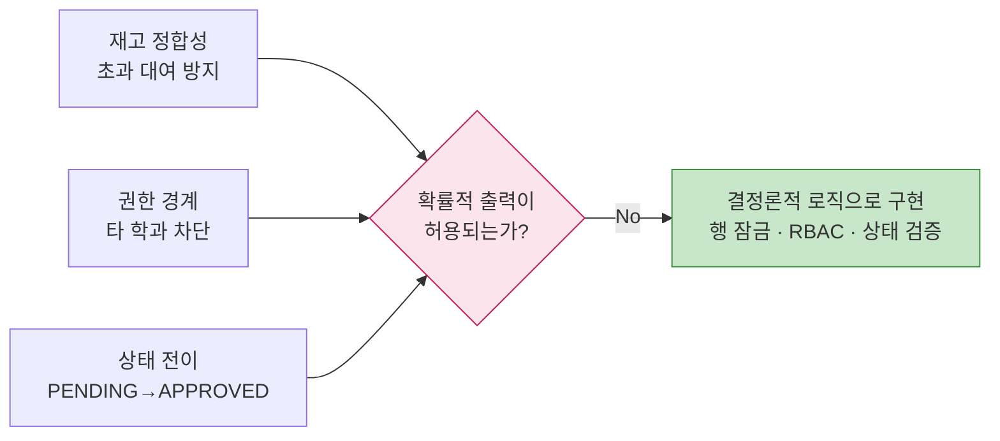
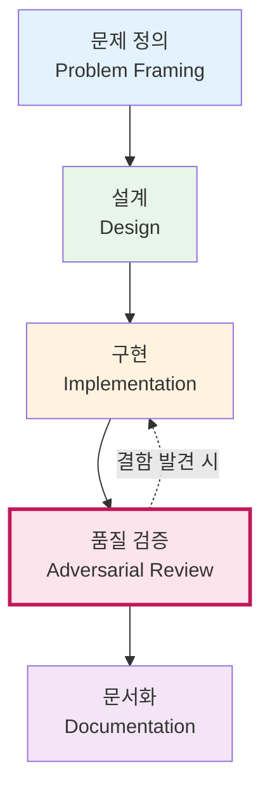
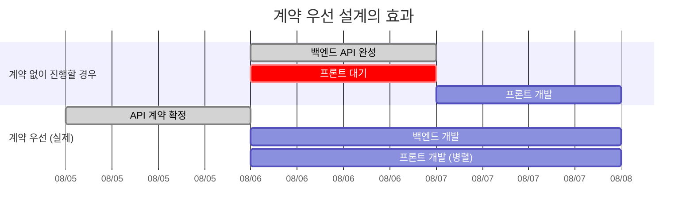

# AI 활용 전략

본 문서는 프로젝트 전 과정에서 AI를 어떻게 활용했는지, 그리고 **왜 서비스 런타임에는 AI를 넣지 않았는지**를 기술합니다.

---

## 1. 핵심 결정 — AI를 어디에 쓸 것인가

프로젝트 착수 시 두 가지 선택지가 있었습니다.

| 선택지 | 내용 | 채택 여부 |
|---|---|---|
| **A. 인앱 AI 기능** | 서비스 안에 LLM을 호출하는 기능을 넣는다 (예: 자연어 기자재 검색, 추천 챗봇) | ❌ |
| **B. 개발 프로세스 AI** | 문제 정의부터 코드 리뷰까지 개발 전 과정에 AI를 투입한다 | ✅ |

### B를 선택한 근거

**① 도메인 특성 — 결정론이 요구되는 영역**

기자재 대여 시스템의 핵심 요구사항은 세 가지입니다.

"이 장비가 지금 몇 개 남았는가"라는 질문에 LLM이 답할 이유가 없습니다. DB가 정확히 답할 수 있고, **정확해야만 하는** 질문입니다. 여기에 확률적 출력을 개입시키면 신뢰성이 훼손됩니다.

**② 사용자 여정에 자연어 병목이 없다**

자연어 인터페이스는 사용자의 의도가 복잡하고 정형화하기 어려울 때 가치가 있습니다. 본 서비스의 사용자 여정은 `학과 선택 → 장비 선택 → 날짜·수량 입력 → 신청`으로, 각 단계가 명확한 선택지를 가집니다. 이 흐름에 챗봇을 넣으면 **클릭 3번이면 끝날 일을 대화 5턴으로 늘리는 결과**가 됩니다.

**③ 한정된 개발 기간의 배분**

개발 기간은 1.5일이었습니다. LLM 연동에 시간을 쓰면 재고 동시성 제어나 권한 검증 같은 **핵심 정합성 로직에 투입할 시간이 줄어듭니다.** 실제로 이 판단 덕분에 확보한 시간을 품질 검증에 투입해 보안 결함 6건을 발견·수정할 수 있었습니다.

> **결론** — AI를 넣지 않은 것은 역량 부족이 아니라 설계 판단입니다. 도구는 문제에 맞아야 하며, 이 문제에 맞는 도구는 트랜잭션과 제약 조건이었습니다.

---

## 2. 단계별 AI 활용

### 2.1 문제 정의 단계

**목표** — 막연한 아이디어("기자재 빌리기 불편하다")를 검증 가능한 문제 정의로 전환

**적용 방법** — 아이디어를 심사 배점과 연결된 5개 질문(거름망)으로 반복 검증했습니다.

| 질문 | 목적 |
|---|---|
| 이 문제를 지금 겪는 사람을 한 명 구체적으로 말할 수 있는가 | 가상의 문제 배제 |
| AI를 빼도 이 서비스가 성립하는가 | AI 필요성의 정직한 평가 |
| 대회 기간 안에 동작하는 데모까지 갈 수 있는가 | 범위 통제 |
| 대회가 끝난 다음 주에도 쓸 사람이 있는가 | 실용성 검증 |
| 90초 안에 설명할 수 있는가 | 기획 완결성 |

**결과** — 두 번째 질문에서 초기 아이디어의 AI 결합이 장식적이라는 판단이 나왔고, 이것이 [1장의 결정](#1-핵심-결정--ai를-어디에-쓸-것인가)으로 이어졌습니다. 최종적으로 5개 문제(P1~P5)를 도출해 [README](../README.md#3-해결하려는-문제)에 기능과 1:1로 대응시켰습니다.

### 2.2 설계 단계

**목표** — 3인 팀의 병렬 개발 가능하게 만들기

**적용 방법** — 코드 작성 전에 **REST API 계약을 문서로 확정**했습니다. 엔드포인트, 요청/응답 스키마, 상태값을 먼저 고정하고 양쪽이 그 계약을 기준으로 독립 작업했습니다.

**결과** — 백엔드 완성을 기다리지 않고 프론트엔드가 즉시 착수했습니다. 프론트엔드는 목업 데이터(`mockData.js`)로 전체 흐름을 먼저 완성한 뒤 실제 API로 전환했으며, 이 목업 계층은 **현장 네트워크 장애 대비 시연 백업**으로도 활용됩니다.

### 2.3 구현 단계

**목표** — 익숙하지 않은 기술 스택에서의 학습 비용 절감

팀은 SQLAlchemy 2.x 비동기 스타일과 JWT 인증 구현 경험이 부족한 상태였습니다. AI를 활용해 최신 관용구(`Mapped[]` 타입 어노테이션, `async_sessionmaker`, `lifespan` 컨텍스트)를 적용했습니다.

**중요한 원칙** — 생성된 코드를 그대로 채택하지 않고, **왜 그렇게 쓰는지 확인한 뒤 적용**했습니다. 예를 들어 `deps.py`의 `require_role(*allowed_roles)` 팩토리 패턴은 역할이 추가될 때 의존성 함수를 새로 만들지 않아도 되는 구조라는 점을 이해하고 채택했습니다.

### 2.4 품질 검증 단계 — 가장 큰 성과

**목표** — 3인 팀의 구조적 약점(상호 코드 리뷰 부재) 보완

3명 중 2명이 개발을 담당하는 구조에서는 서로의 코드를 검토할 여력이 없습니다. 이 공백을 **AI 기반 적대적 리뷰**로 메웠습니다.

**적용 방법** — "이 코드가 잘 작성되었는지"가 아니라 **"이 코드를 어떻게 깨뜨릴 수 있는지"** 를 묻는 방식으로 검토했습니다. 보안, 인가, 동시성, 상태 전이를 각각 별도 관점으로 분리해 점검했습니다.

**발견 및 수정 결과**

| # | 결함 | 심각도 | 수정 내용 |
|---|---|---|---|
| 1 | CORS 명세 위반 — `allow_origins=["*"]`와 `allow_credentials=True` 동시 사용 | 높음 | 인증이 Bearer 헤더 기반이므로 `credentials=False`로 변경 |
| 2 | 타 학과 기자재 등록 가능 — 조교 역할만 검사 | **높음** | 학과 소유권 검증 추가 (`department != current_user.department` → 403) |
| 3 | 재고 차감 레이스 컨디션 — 동시 신청 시 초과 대여 | **높음** | `SELECT ... FOR UPDATE` 행 잠금 적용 |
| 4 | 반납 처리 엔드포인트 부재 — `APPROVED` 상태가 종결되지 않음 | 중간 | `POST /rentals/{id}/return` 신규 구현, `processed_at` 기록 |
| 5 | 이미지 절대 URL 저장 — 서버 IP 변경 시 전체 데이터 무효화 | 중간 | 상대 경로 저장 + 응답 시 base URL 결합으로 변경 |
| 6 | `login`과 `/me`의 `role` 값 불일치 | 낮음 | `ROLE_TO_FRONTEND` 매핑으로 단일화 |

> **2번과 3번은 시연 중에는 드러나지 않는 종류의 결함입니다.** 한 사람이 순차적으로 조작하는 데모에서는 동시 요청도, 타 학과 접근도 발생하지 않습니다. 적대적 관점의 검토가 없었다면 코드에 남았을 것입니다.

이 수정 이력은 커밋 [`e27244d`](https://github.com/Zman927/hackathon-useful-kids/commit/e27244d)에 기록되어 있습니다.

### 2.5 문서화 단계

**목표** — 코드와 문서의 정합성 유지

개발 중 설계가 여러 차례 변경되면서(인증 도입, 대여 기간 추가, 폴더 구조 정리) 문서가 코드보다 뒤처지는 문제가 반복됐습니다.

**적용 방법** — 코드를 기준선으로 삼아 문서 전체를 대조하는 검증을 수행했습니다. 확인 항목:

- 문서에 기재된 엔드포인트가 실제 라우터에 존재하는가
- ERD의 컬럼이 실제 모델과 일치하는가
- README의 폴더 구조가 실제 트리와 일치하는가
- 환경변수명이 코드와 문서에서 동일한가

**결과** — 실제로 `VITE_API_BASE` vs `VITE_API_BASE_URL` 불일치, 삭제된 폴더가 구조도에 남아 있는 문제, 인증 도입 후에도 "인증 없음"으로 남아 있던 명세 등을 발견해 수정했습니다.

---

## 3. AI 활용의 한계와 대응

AI를 활용하며 실제로 겪은 문제와 대응 방식입니다.

| 한계 | 실제 발생 사례 | 대응 |
|---|---|---|
| **컨텍스트 불일치** | 브랜치별로 다른 AI 세션이 진행되어 프론트/백엔드가 서로 다른 구조를 가정 | API 계약과 협업 가이드를 저장소에 문서로 고정해 단일 기준 확보 |
| **그럴듯한 오답** | 존재하지 않는 파일 경로나 함수명을 사실처럼 제시 | 코드 수정 후 반드시 문법 검증 및 실행 확인 |
| **과설계 경향** | 요청하지 않은 추상화 계층·설정 옵션 추가 제안 | "이 프로젝트 규모에 필요한가"를 기준으로 취사 선택 (`services/` 계층 보류 결정) |
| **검증 없는 확신** | 커밋 이력만 보고 "반영되지 않았다"고 잘못 판단 | 결론 전에 실제 파일 내용 대조를 원칙화 |

> AI 산출물은 **검증 대상이지 신뢰 대상이 아니라는 것**이 프로젝트를 통해 얻은 핵심 교훈입니다.

---

## 4. 재현 가능성

본 프로젝트에서 사용한 AI 활용 방식은 특정 도구에 종속되지 않으며, 다음 원칙으로 요약됩니다.

| 원칙 | 설명 |
|---|---|
| **결정론이 필요한 곳에 AI를 넣지 않는다** | 정합성·권한·상태 전이는 코드로 보장한다 |
| **계약을 먼저 고정한다** | 병렬 작업의 전제 조건이며, AI 세션 간 불일치도 방지한다 |
| **적대적으로 검토한다** | "잘 됐는지"가 아니라 "어떻게 깨지는지"를 묻는다 |
| **산출물을 검증한다** | 문법 검사, 실행 확인, 코드-문서 대조를 거친 뒤에만 채택한다 |
| **판단 근거를 남긴다** | 채택뿐 아니라 **배제한 이유**도 문서화한다 |

---

## 5. 향후 AI 도입 여지

인앱 AI를 배제한 것은 현재 범위에서의 판단이며, 서비스가 확장되면 자연어 인터페이스가 가치를 갖는 지점이 생깁니다.

| 시점 | 가능한 AI 기능 | 전제 조건 |
|---|---|---|
| 데이터 축적 후 | 대여 이력 기반 수요 예측 → 장비 구매 예산 편성 근거 | 최소 1~2학기 분량의 대여 이력 |
| 장비 수 증가 후 | "아두이노로 IoT 프로젝트 하려는데 뭐가 필요하지" 형태의 자연어 장비 추천 | 32개 학과 장비 데이터 통합 |
| 운영 정착 후 | 장비 매뉴얼 기반 사용법 Q&A (RAG) | 매뉴얼 문서 확보 |

세 경우 모두 **결정론적 로직으로는 해결되지 않는 문제**이며, 그때가 AI를 도입할 적절한 시점입니다. 상세 계획은 [Roadmap.md](Roadmap.md)를 참고하십시오.

---

## 관련 문서

- [Architecture.md](Architecture.md) — AI 리뷰로 도출된 설계 결정의 구현
- [Product.md](Product.md) — 문제 정의 과정
- [Roadmap.md](Roadmap.md) — 확장 계획
