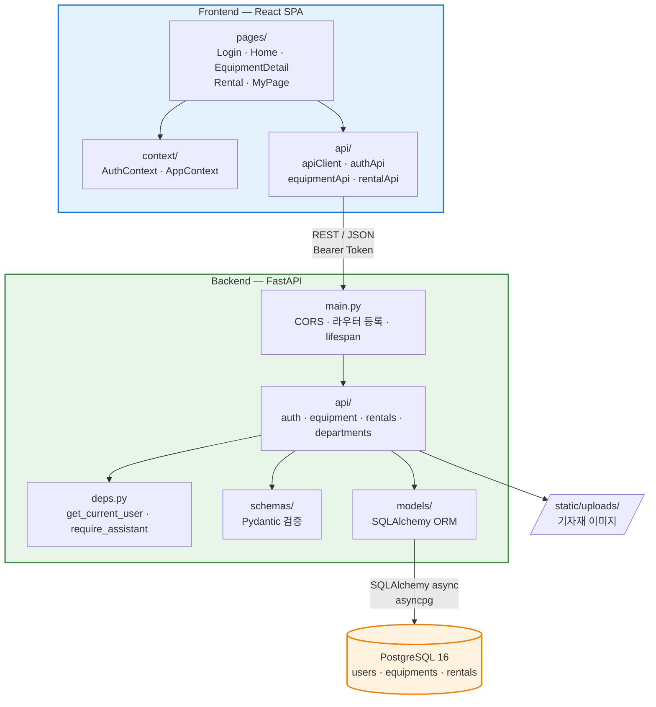
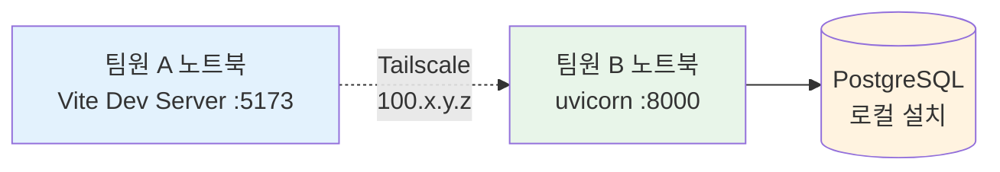
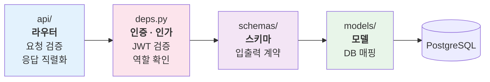
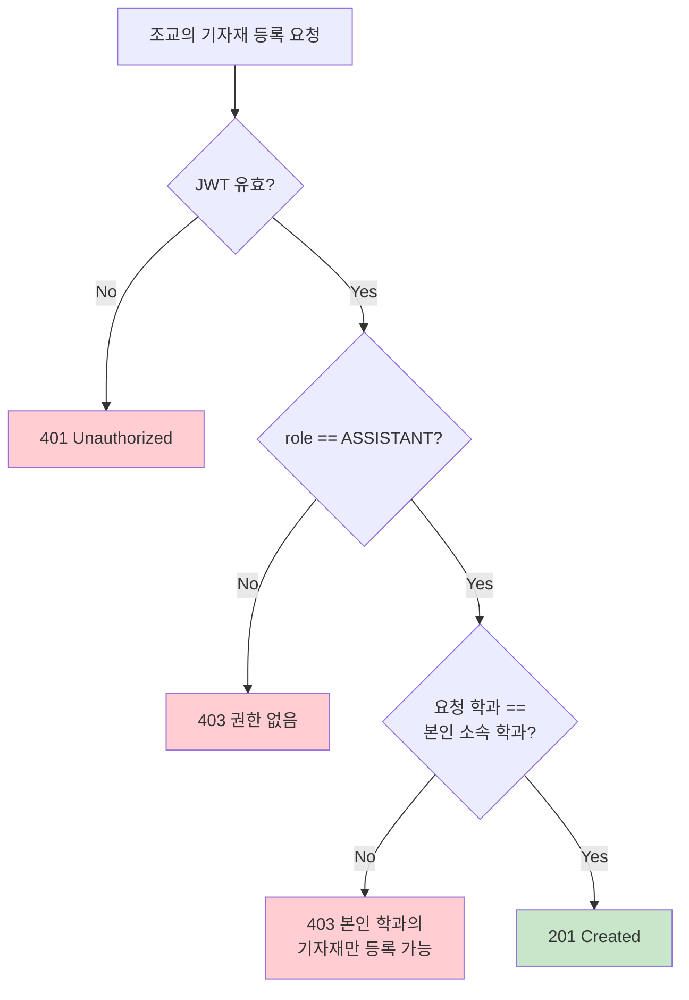
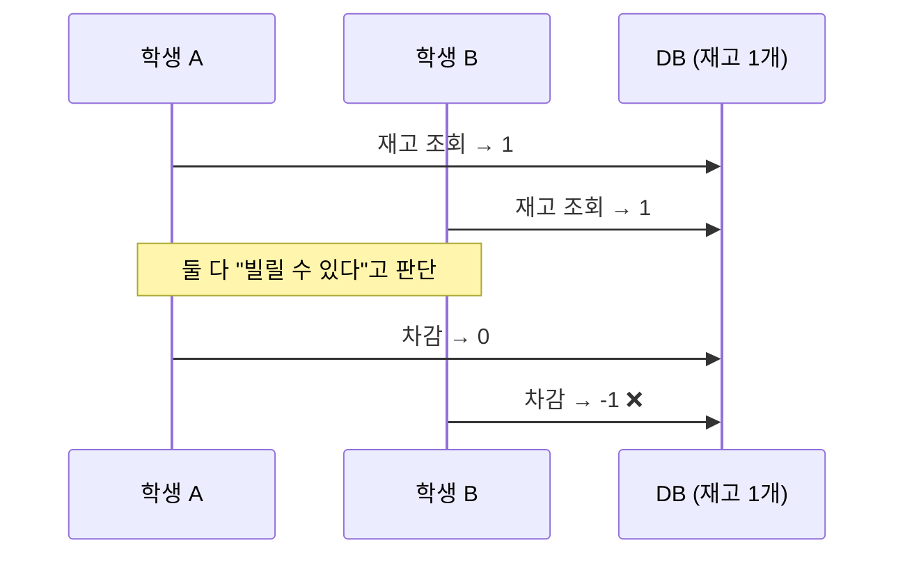
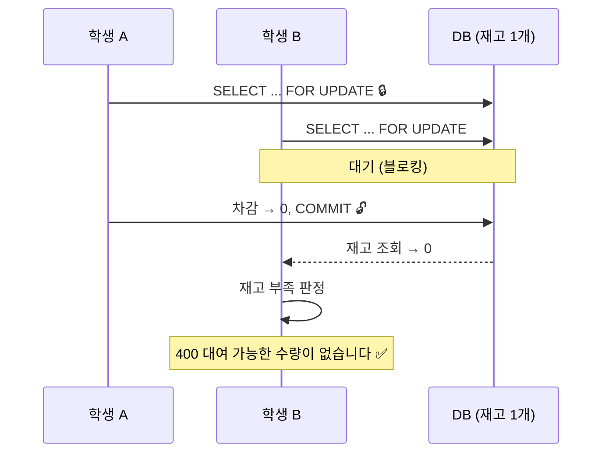
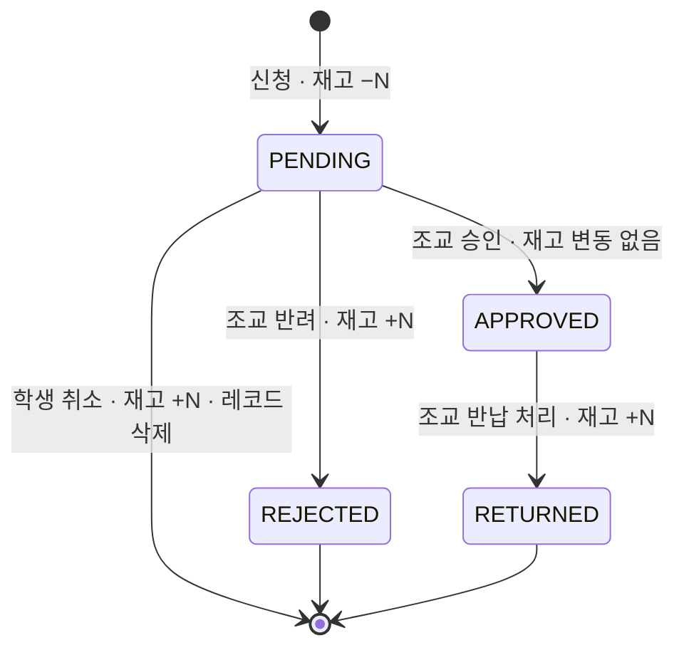
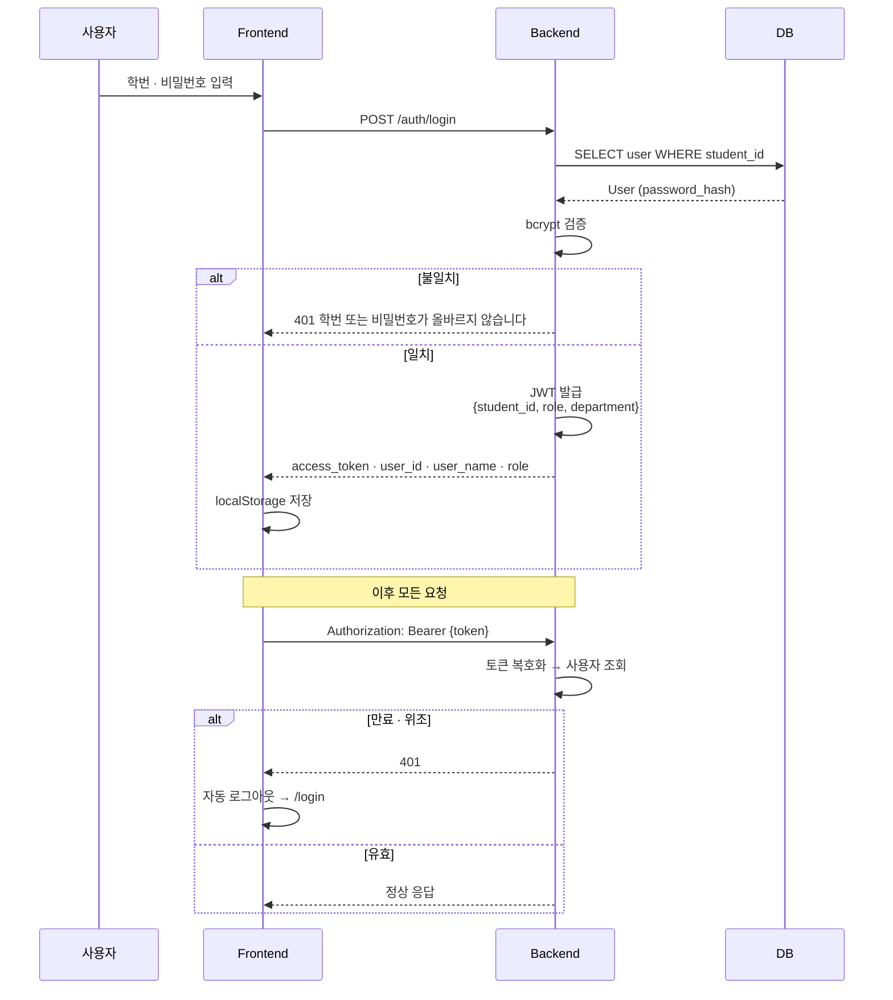
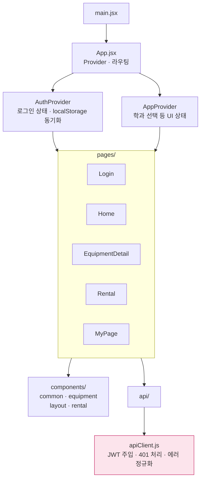

# Architecture

MJC 기자재 대여 플랫폼의 시스템 구조와 설계 결정을 기술합니다.

---

## 1. 시스템 개요



### 실행 환경

프론트엔드와 백엔드는 **각 팀원의 로컬 머신에서 실행**되며, [Tailscale](https://tailscale.com) 메시 네트워크를 통해 통신합니다. 별도의 배포 환경은 두지 않습니다.



**이 구성을 선택한 이유** — 제출물이 GitHub 저장소와 현장 시연으로 규정되어 있어 퍼블릭 접근이 요구되지 않습니다. 클라우드 배포를 도입하면 설정·비용·장애 대응 부담이 발생하는 반면 평가에 기여하는 바가 없습니다. Tailscale은 물리적 네트워크(같은 Wi-Fi 여부)와 무관하게 팀원 간 직접 통신을 제공하므로, 개발 중 사용한 환경을 시연 당일에 그대로 사용할 수 있습니다.

---

## 2. 계층 구조

백엔드는 관심사에 따라 네 계층으로 분리되어 있습니다.



| 계층 | 책임 | 하지 않는 것 |
|---|---|---|
| `api/` | HTTP 요청 수신, 파라미터 검증, 응답 반환 | DB 스키마 직접 노출 |
| `deps.py` | JWT 복호화, 사용자 조회, 역할 검사 | 비즈니스 규칙 판단 |
| `schemas/` | 입출력 형태 정의, 타입 검증 | DB 접근 |
| `models/` | 테이블 구조 및 관계 정의 | HTTP 관심사 |

> **`services/` 계층에 대하여** — 초기 설계에는 비즈니스 로직 전용 계층을 두었으나, 현재 규모(3개 엔티티, 9개 엔드포인트)에서는 라우터 함수 자체가 충분히 응집적이어서 도입 시 간접 계층만 늘어나는 것으로 판단했습니다. 디렉터리는 확장 지점으로 유지하되, 로직 규모가 커지는 시점에 분리합니다.

---

## 3. 핵심 설계 결정

### 3.1 권한과 소유권의 분리

역할(Role)만으로 접근을 통제하면 "조교라면 아무 학과 기자재나 등록할 수 있다"는 결함이 발생합니다. 본 시스템은 **두 가지를 별개 관심사로 검증**합니다.



이 검증은 기자재 등록·수정뿐 아니라 **대여 신청 승인·반려·반납 처리에도 동일하게 적용**됩니다. 조교는 본인 학과 기자재에 대한 신청만 처리할 수 있습니다.

### 3.2 동시성 제어 — 재고 정합성

여러 학생이 마지막 남은 장비를 동시에 신청하는 상황에서, 단순한 `조회 → 검사 → 차감` 순서는 초과 대여를 허용합니다.

**문제 상황 (제어 없음)**



**해결 — 행 잠금 적용**



```python
# backend/app/api/rentals.py
equipment_result = await db.execute(
    select(Equipment).where(Equipment.id == payload.equipment_id).with_for_update()
)
```

PostgreSQL을 선택한 이유가 여기에 있습니다. SQLite는 이 수준의 행 단위 잠금을 제공하지 않습니다.

### 3.3 재고 생애주기

재고는 **신청 시점에 차감**되고, 흐름이 종료되는 모든 경로에서 복원됩니다. 승인 대기 중인 신청도 재고를 점유하므로, 조교가 아직 처리하지 않은 장비가 다른 학생에게 이중 배정되지 않습니다.



| 전이 | 재고 영향 | 수행 주체 | 조건 |
|---|---|---|---|
| 신청 → `PENDING` | `−quantity` | 학생 | 재고 충분 |
| `PENDING` → `APPROVED` | 없음 | 조교(본인 학과) | 상태가 `PENDING` |
| `PENDING` → `REJECTED` | `+quantity` | 조교(본인 학과) | 상태가 `PENDING` |
| `PENDING` → 삭제 | `+quantity` | 학생(본인 신청) | 상태가 `PENDING` |
| `APPROVED` → `RETURNED` | `+quantity` | 조교(본인 학과) | 상태가 `APPROVED` |

### 3.4 인증 흐름



**설계 특성**

- 비밀번호는 bcrypt로 해싱하여 저장하며 평문을 보관하지 않습니다.
- JWT는 무상태(stateless)이므로 서버에 세션 저장소가 필요하지 않습니다.
- 토큰 페이로드에 `role`과 `department`를 포함하지만, **권한 판단은 항상 DB에서 다시 조회한 사용자 정보를 기준**으로 합니다. 토큰 발급 이후 권한이 변경된 경우에도 즉시 반영되도록 하기 위함입니다.
- CORS는 `allow_origins=["*"]`, `allow_credentials=False` 조합을 사용합니다. 인증을 쿠키가 아닌 `Authorization` 헤더로 처리하므로 credentials가 불필요하며, `"*"`와 `credentials=True`의 동시 사용은 브라우저 CORS 명세 위반입니다.

### 3.5 학과 마스터 데이터

32개 학과는 DB 테이블이 아니라 **애플리케이션 상수**(`models/departments.py`)로 관리합니다.

```python
@dataclass(frozen=True)
class DepartmentInfo:
    id: int
    college: str
    department: Department
```

| 판단 기준 | 내용 |
|---|---|
| 변경 빈도 | 학과 구성은 학기 단위로도 거의 변하지 않는 정적 데이터 |
| 참조 무결성 | `Enum` 타입으로 DB 컬럼에 제약을 걸어 잘못된 값 저장을 차단 |
| 조회 비용 | 매 요청마다 학과 목록을 JOIN할 필요가 없음 |
| 확장 방식 | 학과 추가 시 리스트에 한 줄 추가 — 스키마 마이그레이션 불필요 |

학과가 동적으로 관리되어야 하는 요구가 생기면 별도 테이블로 승격할 수 있도록, 조회 인터페이스(`department_by_id`, `department_id_of`)를 함수로 분리해 두었습니다.

### 3.6 이미지 저장 전략

기자재 이미지는 DB에 **상대 경로만 저장**하고, 응답 시 요청의 `base_url`을 결합해 절대 URL로 변환합니다.

```python
# 저장: /static/uploads/abc123.jpg
# 응답: http://100.74.207.33:8000/static/uploads/abc123.jpg
EquipmentOut.from_equipment(equipment, str(request.base_url))
```

Tailscale IP나 포트가 변경되어도 DB 데이터를 수정할 필요가 없습니다. 절대 URL을 저장했다면 환경이 바뀔 때마다 전체 레코드를 갱신해야 합니다.

---

## 4. 프론트엔드 구조



**API 통신 계층 단일화** — 모든 백엔드 호출은 `apiClient.js`의 `request()` 함수를 경유합니다. 이를 통해 토큰 주입, 401 응답 시 자동 로그아웃, 에러 메시지 정규화를 **한 곳에서 처리**하며, 개별 API 모듈은 엔드포인트와 데이터 변환에만 집중합니다.

**오프라인 시연 모드** — `VITE_USE_MOCK=true` 환경변수로 목업 데이터 기반 동작으로 전환할 수 있습니다. 현장 네트워크 장애 시에도 전체 사용자 흐름을 시연할 수 있도록 마련한 안전장치입니다.

---

## 5. 확장 관점에서의 평가

| 확장 시나리오 | 현재 구조의 대응 | 필요 작업 |
|---|---|---|
| 학과 추가 | 마스터 데이터 분리됨 | `DEPARTMENTS` 리스트에 항목 추가 |
| 신규 엔드포인트 | 라우터 · 스키마 계층 분리됨 | `api/`에 파일 추가 후 `main.py`에 등록 |
| 권한 종류 추가 (예: 학과장) | `require_role(*roles)` 팩토리 | `Role` Enum 확장 후 의존성 선언 |
| 비즈니스 로직 비대화 | `services/` 확장 지점 확보 | 라우터에서 로직 추출 |
| 배포 환경 도입 | 설정이 환경변수로 외부화됨 | `.env` 값 교체 (코드 수정 불필요) |
| 다중 인스턴스 운영 | JWT 무상태 인증 | 이미지 저장소를 공유 스토리지로 전환 필요 |

---

## 관련 문서

- [Database.md](Database.md) — ERD 및 테이블 명세
- [API.md](API.md) — 엔드포인트 명세
- [AI.md](AI.md) — AI 활용 전략
- [Roadmap.md](Roadmap.md) — 단계별 확장 계획
