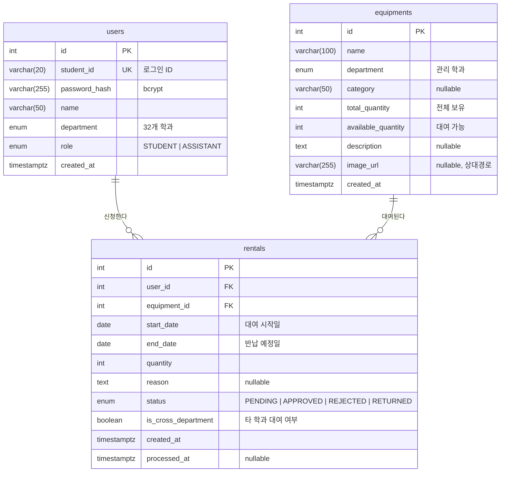
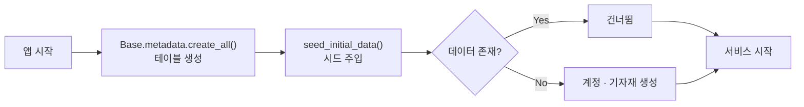

# Database

데이터 모델 설계와 테이블 명세를 기술합니다. 실제 구현은 [`backend/app/models/`](../backend/app/models/)에 있습니다.

- **DBMS**: PostgreSQL 16
- **ORM**: SQLAlchemy 2.x (`Mapped[]` 타입 어노테이션 스타일, async)
- **드라이버**: `asyncpg`

---

## 1. ERD

**관계 요약**

| 관계 | 카디널리티 | 의미 |
|---|---|---|
| `users` → `rentals` | 1 : N | 한 사용자가 여러 건을 신청 |
| `equipments` → `rentals` | 1 : N | 한 기자재가 여러 대여 이력을 가짐 |

`rentals`는 두 엔티티를 잇는 교차 테이블이지만, 자체 속성(기간·수량·상태·처리 시각)을 가지므로 독립 엔티티로 모델링했습니다.

---

## 2. 테이블 명세

### 2.1 `users`

학생과 조교를 하나의 테이블에서 `role`로 구분합니다. 두 역할의 속성이 동일하고, 분리할 경우 인증 로직이 이원화되기 때문입니다.

| 컬럼 | 타입 | 제약 | 설명 |
|---|---|---|---|
| `id` | `SERIAL` | PK, INDEX | 내부 식별자 |
| `student_id` | `VARCHAR(20)` | UNIQUE, NOT NULL, INDEX | 로그인 ID (학번 또는 조교 계정명) |
| `password_hash` | `VARCHAR(255)` | NOT NULL | bcrypt 해시. 평문 미저장 |
| `name` | `VARCHAR(50)` | NOT NULL | 표시 이름 |
| `department` | `department_enum` | NOT NULL | 소속 학과 |
| `role` | `role_enum` | NOT NULL | `STUDENT` \| `ASSISTANT` |
| `created_at` | `TIMESTAMPTZ` | DEFAULT `now()` | 생성 시각 |

> `student_id`에 UNIQUE 인덱스가 걸려 있어 로그인 조회(`WHERE student_id = ?`)가 인덱스 스캔으로 처리됩니다.

### 2.2 `equipments`

| 컬럼 | 타입 | 제약 | 설명 |
|---|---|---|---|
| `id` | `SERIAL` | PK, INDEX | 내부 식별자 |
| `name` | `VARCHAR(100)` | NOT NULL | 기자재명 |
| `department` | `department_enum` | NOT NULL | **관리 주체 학과.** 조교 권한 검증의 기준 |
| `category` | `VARCHAR(50)` | NULL 허용 | 분류 (예: 측정장비) |
| `total_quantity` | `INTEGER` | NOT NULL, DEFAULT 0 | 전체 보유 수량 |
| `available_quantity` | `INTEGER` | NOT NULL, DEFAULT 0 | 현재 대여 가능 수량 |
| `description` | `TEXT` | NULL 허용 | 상세 설명 |
| `image_url` | `VARCHAR(255)` | NULL 허용 | **상대 경로** (예: `/static/uploads/a1b2.jpg`) |
| `created_at` | `TIMESTAMPTZ` | DEFAULT `now()` | 등록 시각 |

**`total_quantity`와 `available_quantity`를 함께 두는 이유**

`available_quantity`를 `total - SUM(활성 대여 수량)`으로 매번 계산하지 않고 별도 컬럼으로 관리합니다.

- 조회 시 집계 쿼리가 불필요해 목록 API가 단순해집니다.
- 무엇보다, **행 잠금으로 원자적 갱신이 가능**해집니다. 계산식 방식에서는 잠글 대상 행이 명확하지 않아 동시성 제어가 어렵습니다.

트레이드오프로 두 값의 정합성 유지 책임이 애플리케이션에 있으므로, 재고를 변경하는 모든 경로를 [Architecture.md의 재고 생애주기](Architecture.md#33-재고-생애주기)에 명시했습니다.

### 2.3 `rentals`

| 컬럼 | 타입 | 제약 | 설명 |
|---|---|---|---|
| `id` | `SERIAL` | PK, INDEX | 신청 번호 |
| `user_id` | `INTEGER` | FK → `users.id`, NOT NULL, INDEX | 신청자 |
| `equipment_id` | `INTEGER` | FK → `equipments.id`, NOT NULL, INDEX | 대상 기자재 |
| `start_date` | `DATE` | NOT NULL | 대여 시작일 |
| `end_date` | `DATE` | NOT NULL | 반납 예정일 |
| `quantity` | `INTEGER` | NOT NULL, DEFAULT 1 | 신청 수량 |
| `reason` | `TEXT` | NULL 허용 | 대여 사유 |
| `status` | `rental_status_enum` | NOT NULL, DEFAULT `PENDING` | 처리 상태 |
| `is_cross_department` | `BOOLEAN` | NOT NULL, DEFAULT `false` | 타 학과 기자재 대여 여부 |
| `created_at` | `TIMESTAMPTZ` | DEFAULT `now()` | 신청 시각 |
| `processed_at` | `TIMESTAMPTZ` | NULL 허용 | 승인·반려·반납 처리 시각 |

**`is_cross_department`의 역할**

신청 시점에 `기자재.department != 신청자.department`를 평가해 저장합니다. 조교가 대시보드에서 타 학과 학생의 신청을 식별하고 판단 근거로 삼기 위한 필드로, 실제 학과 운영 정책(타 학과 대여 시 별도 확인 절차)을 반영합니다.

계산 가능한 값을 저장하는 이유는 **신청 시점의 사실을 보존**하기 위함입니다. 이후 사용자의 소속 학과가 변경되더라도 신청 당시의 판단 근거가 유지됩니다.

`user_id`와 `equipment_id` 양쪽에 인덱스를 둔 것은 두 조회 패턴을 모두 지원하기 위함입니다 — 학생의 "내 대여 내역"(`WHERE user_id = ?`)과 조교의 "학과 전체 현황"(`JOIN equipments`).

---

## 3. Enum 타입

DB 레벨 `ENUM` 타입으로 정의하여 애플리케이션 버그로 인한 잘못된 값 저장을 차단합니다.

### `role_enum`

| 값 | 설명 | 프론트엔드 표현 |
|---|---|---|
| `STUDENT` | 학생 — 조회 · 신청 · 취소 | `student` |
| `ASSISTANT` | 조교 — 학생 권한 + 승인 · 반려 · 반납 · 기자재 관리 | `admin` |

> DB는 도메인 용어(`ASSISTANT`)를, 프론트엔드는 UI 관례(`admin`)를 사용합니다. 변환은 [`schemas/user.py`](../backend/app/schemas/user.py)의 `ROLE_TO_FRONTEND` 매핑 **한 곳에서만** 수행되어, 표현 계층 변경이 도메인 모델에 영향을 주지 않습니다.

### `rental_status_enum`

| 값 | 의미 | 재고 점유 |
|---|---|---|
| `PENDING` | 심사 중 | ✅ 점유 |
| `APPROVED` | 대여 중 | ✅ 점유 |
| `REJECTED` | 반려됨 | ❌ 해제 |
| `RETURNED` | 반납 완료 | ❌ 해제 |

### `department_enum`

32개 학과 값을 가집니다. 학과 ID·소속 학부 정보는 [`models/departments.py`](../backend/app/models/departments.py)에 마스터 데이터로 관리됩니다.

| 학부 | 학과 수 |
|---|---|
| AI·SW융합학부 | 5 |
| 스마트시스템공학부 | 6 |
| 경영·휴먼라이프학부 | 11 |
| 예술·건강학부 | 9 |
| 자유전공학부 | 1 |

설계 근거는 [Architecture.md — 학과 마스터 데이터](Architecture.md#35-학과-마스터-데이터)를 참고하십시오.

---

## 4. 스키마 생성 및 초기 데이터

애플리케이션 시작 시([`main.py`](../backend/app/main.py)의 `lifespan`) 다음이 수행됩니다.

시드 함수는 **멱등(idempotent)** 하게 구현되어 있어 재시작 시 중복 생성되지 않습니다.

**시드 데이터** — 5개 학과 × (조교 1 + 학생 1 + 기자재 1). 비밀번호는 모두 `pwd123`이며 계정 목록은 [README](../README.md#데모-계정)에 있습니다.

> **마이그레이션 도구를 사용하지 않는 이유** — Alembic 등의 도구는 운영 중 데이터를 보존하며 스키마를 변경할 때 가치가 있습니다. 본 프로젝트는 개발 기간이 1.5일이고 운영 데이터가 없어, 도구 도입 비용이 이득을 초과합니다. 실제 학과 도입 단계에서는 Alembic 도입이 필요하며 이는 [Roadmap.md](Roadmap.md)에 명시되어 있습니다.

---

## 5. 주요 쿼리 패턴

| 기능 | 쿼리 | 인덱스 활용 |
|---|---|---|
| 로그인 | `SELECT * FROM users WHERE student_id = ?` | `student_id` UNIQUE |
| 학과별 기자재 | `SELECT * FROM equipments WHERE department = ?` | 순차 스캔 (레코드 소수) |
| 내 대여 내역 | `SELECT * FROM rentals WHERE user_id = ? ORDER BY created_at DESC` | `user_id` |
| 학과 대여 현황 | `SELECT r.* FROM rentals r JOIN equipments e ON r.equipment_id = e.id WHERE e.department = ?` | `equipment_id` |
| **재고 차감** | `SELECT * FROM equipments WHERE id = ? FOR UPDATE` | PK + 행 잠금 |

---

## 관련 문서

- [Architecture.md](Architecture.md) — 동시성 제어 및 설계 결정
- [API.md](API.md) — 각 테이블을 다루는 엔드포인트
