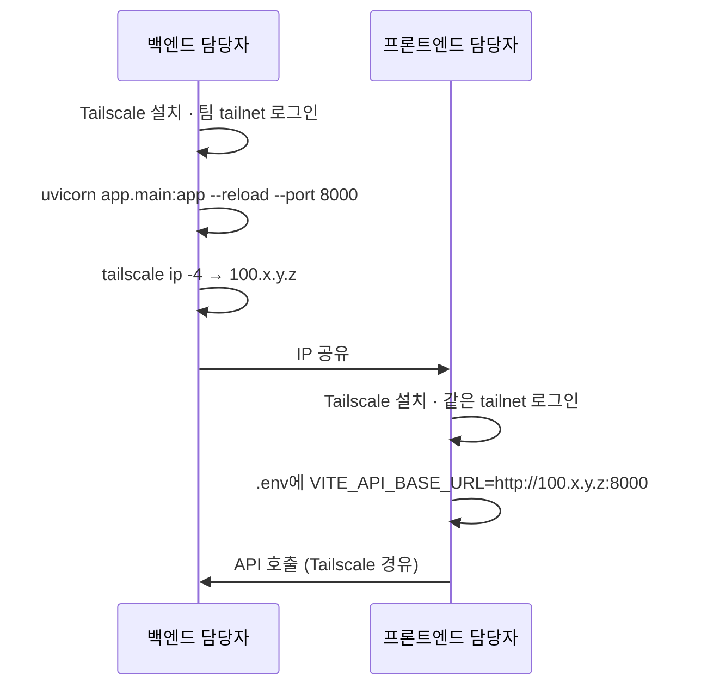
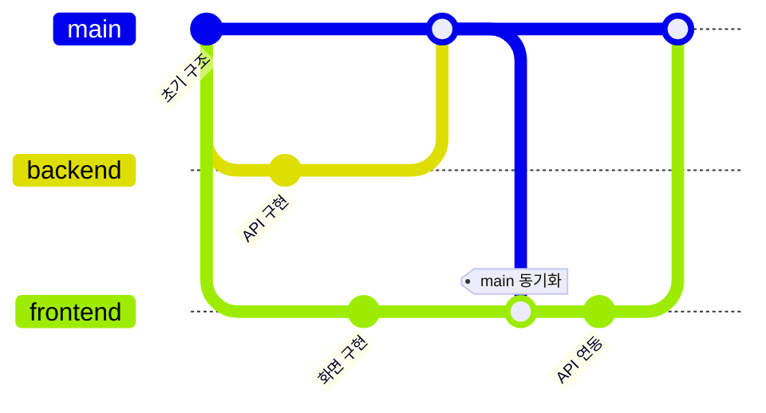

# Development Guide

개발 환경 구성, 협업 규약, 코드 컨벤션을 기술합니다.

---

## 1. 개발 환경 구성

설치 절차는 [README — 설치 방법](../README.md#10-설치-방법)에 있습니다. 이 문서는 그 이후의 개발 관련 사항을 다룹니다.

### 1.1 사전 요구사항

| 도구 | 버전 | 확인 명령 |
|---|---|---|
| Node.js | 18+ | `node -v` |
| Python | 3.11+ | `python --version` |
| PostgreSQL | 16+ | `psql --version` |
| Git | 2.x | `git --version` |

### 1.2 환경변수

**`backend/.env`**

| 변수 | 예시 | 설명 |
|---|---|---|
| `DATABASE_URL` | `postgresql+asyncpg://postgres:pw@localhost:5432/equipment_rental` | 비동기 드라이버(`asyncpg`) 지정 필수 |
| `SECRET_KEY` | 랜덤 문자열 | JWT 서명 키. 팀원 간 공유 시 동일해야 토큰 호환 |
| `ALGORITHM` | `HS256` | JWT 서명 알고리즘 |
| `ACCESS_TOKEN_EXPIRE_MINUTES` | `60` | 토큰 만료 시간(분) |

**`frontend/.env`**

| 변수 | 예시 | 설명 |
|---|---|---|
| `VITE_API_BASE_URL` | `http://localhost:8000` | 백엔드 주소. 팀원 서버 사용 시 Tailscale IP |
| `VITE_USE_MOCK` | `false` | `true`로 설정 시 백엔드 없이 목업 데이터로 동작 |

> `.env` 파일은 절대 커밋하지 않습니다. `.gitignore`에 등록되어 있으며, 새 변수를 추가할 때는 `.env.example`도 함께 갱신하십시오.

---

## 2. 팀 간 네트워크 구성 (Tailscale)

프론트엔드와 백엔드가 서로 다른 컴퓨터에서 실행될 때 사용합니다. 물리적 네트워크(같은 Wi-Fi 여부)와 무관하게 연결됩니다.



**주의** — 백엔드 담당자가 컴퓨터를 끄거나 `uvicorn`을 중지하면 프론트엔드의 모든 API 호출이 실패합니다. 이는 버그가 아니라 "백엔드 미가동" 상태입니다.

**시연 시 백업 절차** — 현장 네트워크가 불안정할 경우:
1. 프론트엔드·백엔드를 한 대의 노트북에서 함께 실행하고 `VITE_API_BASE_URL=http://localhost:8000`으로 전환
2. 그마저 어려우면 `VITE_USE_MOCK=true`로 목업 모드 시연

---

## 3. 브랜치 전략

### 3.1 운영 방식



| 브랜치 | 역할 |
|---|---|
| `main` | 통합 브랜치. 항상 시연 가능한 상태를 유지 |
| `backend` | 백엔드 작업 브랜치 |
| `frontend` | 프론트엔드 작업 브랜치 |

### 3.2 작업 절차

**작업 시작 전 — main 동기화**

```bash
git checkout <본인 브랜치>
git merge main
```

**작업 완료 후 — main으로 통합**

```bash
git checkout main
git pull origin main
git merge <본인 브랜치>
git push origin main
```

### 3.3 표준 GitFlow와의 차이

일반적인 GitFlow는 `develop` 통합 브랜치와 `feature/*`, `fix/*` 세부 브랜치를 둡니다. 본 프로젝트는 **팀 3명, 개발 기간 1.5일**이라는 조건에서 `develop` 계층이 조율 비용만 증가시킨다고 판단해 생략했습니다.

기능 단위가 커질 경우 각 브랜치 하위에 `feature/*`로 분기하는 것을 권장하며, 팀 규모가 확대되면 표준 GitFlow로 전환할 수 있는 구조입니다.

### 3.4 충돌 처리 원칙

| 상황 | 처리 |
|---|---|
| 본인 담당 영역(`backend/` 또는 `frontend/`) 충돌 | 본인 버전 유지 |
| 문서(`docs/`, `README.md`) 충돌 | 최신 코드 기준으로 통합 |
| 머지 전 미커밋 작업 존재 | **반드시 먼저 커밋**한 뒤 머지 (파일 이동·이름 변경이 섞이면 충돌이 복잡해짐) |

---

## 4. 커밋 컨벤션

형식: `<type>: <내용>`

| Type | 용도 | 예시 |
|---|---|---|
| `feat` | 새 기능 추가 | `feat: 대여 신청 취소 API 추가` |
| `fix` | 버그 수정 | `fix: 재고 0일 때 승인이 차단되지 않던 문제 수정` |
| `refactor` | 동작 변경 없는 구조 개선 | `refactor: 라우터를 api/ 디렉터리로 이동` |
| `docs` | 문서만 변경 | `docs: API 명세에 반납 엔드포인트 추가` |
| `style` | 포맷팅 등 의미 없는 변경 | `style: 들여쓰기 정리` |
| `test` | 테스트 추가·수정 | `test: 재고 부족 케이스 추가` |
| `chore` | 패키지·설정 등 기타 | `chore: python-multipart 의존성 추가` |

**원칙**

- 한 커밋에는 한 종류의 변경만 담습니다. 여러 type이 섞이면 커밋을 분리하십시오.
- 제목만으로 변경 내용이 파악되어야 합니다. `fix: 버그 수정` 같은 제목은 지양합니다.
- 기능이 완성될 때까지 기다리지 말고 작업이 끊기는 지점마다 커밋합니다.
- **하루 최소 1회 push** — 다른 팀원이 작업을 이어받을 수 있는 상태를 유지하기 위함입니다.

---

## 5. 코드 컨벤션

### 5.1 Backend (Python)

| 항목 | 규칙 |
|---|---|
| 타입 힌트 | 모든 함수 시그니처에 명시. SQLAlchemy 모델은 `Mapped[]` 스타일 사용 |
| 비동기 | DB 접근 경로는 `async def` + `await`. 동기 호출 혼용 금지 |
| 라우터 책임 | 요청 검증·응답 직렬화만 수행. 파일당 하나의 리소스 |
| 오류 메시지 | `HTTPException`의 `detail`은 **한국어**로 작성 (사용자에게 그대로 노출됨) |
| 임포트 순서 | 표준 라이브러리 → 서드파티 → `app.*` |
| 주석 | 자명하지 않은 판단(잠금 사용 이유, CORS 설정 근거 등)에만 작성 |

```python
# 권장 예시
@router.post("", response_model=RentalOut, status_code=status.HTTP_201_CREATED)
async def create_rental(
    payload: RentalCreateIn,
    current_user: User = Depends(get_current_user),
    db: AsyncSession = Depends(get_db),
):
    # 행 잠금 — 동시 신청 시 재고 체크·차감을 원자적으로 처리
    result = await db.execute(
        select(Equipment).where(Equipment.id == payload.equipment_id).with_for_update()
    )
```

### 5.2 Frontend (React)

| 항목 | 규칙 |
|---|---|
| 컴포넌트 | 함수형 + Hooks. 파일당 하나, `PascalCase` |
| API 호출 | 반드시 `api/` 계층 경유. 컴포넌트에서 `fetch` 직접 호출 금지 |
| 상태 관리 | 지역 상태는 `useState`, 전역은 Context |
| 스타일 | Tailwind 유틸리티 클래스. 별도 CSS 파일 신설 지양 |
| 필수 UI 상태 | 모든 데이터 화면은 **로딩 / 빈 상태 / 에러** 세 가지를 반드시 처리 |

```jsx
// 권장 예시 — 세 가지 상태 처리
if (loading) return <Spinner />;
if (error) return <EmptyState message={error} />;
if (items.length === 0) return <EmptyState message="등록된 기자재가 없습니다." />;
```

---

## 6. API 계약 관리

프론트엔드와 백엔드는 [API.md](API.md)의 명세를 **단일 기준(single source of truth)** 으로 삼습니다.

**변경 절차**

1. 변경 필요성을 팀에 공유
2. [API.md](API.md) 먼저 수정
3. 백엔드·프론트엔드 양쪽 구현 반영

> 한쪽만 조용히 변경하면 통합 시점에 반드시 문제가 발생합니다. 문서를 먼저 고치는 것이 원칙입니다.

---

## 7. 검증

### 7.1 백엔드

```bash
# 문법 검증
cd backend
python -c "import ast, glob; [ast.parse(open(f, encoding='utf-8').read(), f) for f in glob.glob('app/**/*.py', recursive=True)]"

# 실행 확인
uvicorn app.main:app --reload --port 8000
curl http://localhost:8000/health    # {"status":"ok"}
```

`http://localhost:8000/docs`에서 Swagger UI로 각 엔드포인트를 직접 호출해 볼 수 있습니다.

### 7.2 프론트엔드

```bash
cd frontend
npm run build      # 빌드 오류 확인
npm run dev        # 개발 서버
```

### 7.3 통합 검증 시나리오

시연 전 다음 순서로 전체 흐름을 확인합니다.

| # | 단계 | 기대 결과 |
|---|---|---|
| 1 | `2026001` / `pwd123` 로그인 | 홈 진입, 학과 선택 가능 |
| 2 | 컴퓨터공학과 선택 | 라즈베리 파이 4 (잔여 5) 표시 |
| 3 | 대여 신청 (수량 1) | 잔여 4로 감소, 마이페이지에 `심사중` |
| 4 | 로그아웃 후 `com` / `pwd123` 로그인 | 조교 대시보드 표시 |
| 5 | 신청 승인 | 상태 `대여중`, 잔여 4 유지 |
| 6 | 반납 처리 | 상태 `반납완료`, 잔여 5로 복원 |

---

## 8. 배포에 관하여

본 프로젝트는 **별도의 배포 환경을 구성하지 않습니다.**

| 항목 | 판단 |
|---|---|
| 제출 형태 | GitHub 저장소 + 현장 시연 |
| 퍼블릭 접근 필요성 | 없음 — 심사위원의 원격 접속이 요구되지 않음 |
| 도입 시 비용 | 호스팅 설정, 환경변수 관리, 장애 대응 |
| 도입 시 이득 | 평가 기준상 없음 |

개발 중 사용한 로컬 환경(uvicorn + PostgreSQL + Tailscale)을 시연에 그대로 사용합니다. 이는 **개발 환경과 시연 환경의 차이에서 발생하는 문제를 원천 차단**하는 효과도 있습니다.

실제 학과 도입 단계에서는 배포가 필요하며, 현재 설정이 환경변수로 외부화되어 있어 코드 수정 없이 전환 가능합니다. 상세 계획은 [Roadmap.md](Roadmap.md)를 참고하십시오.

---

## 관련 문서

- [Troubleshooting.md](Troubleshooting.md) — 문제 발생 시 진단 절차
- [API.md](API.md) — API 계약
- [CONTRIBUTING.md](../CONTRIBUTING.md) — 기여 절차
