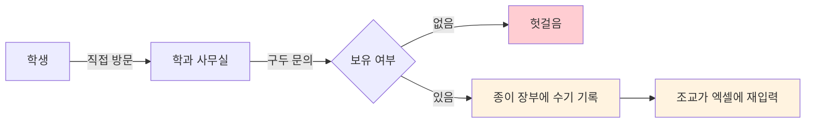

# Product

문제 정의, 요구사항, 범위 결정 근거를 기술합니다.

---

## 1. 문제 정의

### 1.1 현황

교내 공학관에는 **32개 학과가 각자 기자재를 보유·관리**하고 있습니다. 대여 절차는 다음과 같습니다.

### 1.2 문제 목록

| # | 문제 | 대상 | 근거 |
|---|---|---|---|
| **P1** | 재고를 사전에 알 수 없어 헛걸음이 발생한다 | 학생 | 온라인 조회 수단이 존재하지 않음 |
| **P2** | 본인의 대여 이력을 확인할 방법이 없다 | 학생 | 기록이 학과 사무실 장부에만 존재 |
| **P3** | 종이 장부와 엑셀 파일을 이중 관리한다 | 조교 | 동일 정보를 두 번 기록 |
| **P4** | 수기 계산이라 실물과 장부 수량이 어긋난다 | 조교 | 대여·반납 시점의 수동 갱신 |
| **P5** | 학과 간 관리 권한 경계가 시스템적으로 없다 | 학과 | 물리적 분리에만 의존 |

이 문제들은 학과 수(32개)만큼 **중복 발생**합니다. 개별 학과의 불편이 아니라 구조적 문제입니다.

### 1.3 타깃 사용자

| 페르소나 | 상황 | 필요한 것 |
|---|---|---|
| **학생** | 캡스톤 프로젝트에 라즈베리 파이가 필요하다. 학과에 있는지 모르겠고, 있어도 남았는지 모른다 | 방문 전 재고 확인, 즉시 신청, 진행 상태 확인 |
| **조교** | 학과 기자재를 관리한다. 대여 요청이 올 때마다 장부를 확인하고 엑셀에 옮겨 적는다 | 신청 목록 한눈에 보기, 승인·반납 처리, 자동 재고 반영 |

---

## 2. 아이템 검증 과정

아이디어를 다음 5개 질문으로 검증했습니다. 각 질문은 심사 배점 항목과 대응됩니다.

| 질문 | 연결 배점 | 검증 결과 |
|---|---|---|
| 이 문제를 지금 겪는 사람을 한 명 구체적으로 말할 수 있는가 | 문제 정의 | ✅ 팀원 본인이 공학관 재학생이며 직접 경험 |
| AI를 빼도 이 서비스가 성립하는가 | AI 활용 | ⚠️ 성립함 → **AI를 개발 프로세스에 투입하는 전략으로 전환** ([AI.md](AI.md)) |
| 대회 기간 안에 동작하는 데모까지 갈 수 있는가 | 기술 구현 | ✅ 범위를 MVP로 통제 |
| 대회가 끝난 다음 주에도 쓸 사람이 있는가 | 실용성 | ✅ 학과 조교가 즉시 사용 가능 |
| 90초 안에 설명할 수 있는가 | 전 항목 | ✅ "종이 장부를 웹으로 옮기고 재고를 자동화한다" |

두 번째 질문의 결과가 프로젝트의 방향을 결정했습니다. 상세 근거는 [AI.md](AI.md#1-핵심-결정--ai를-어디에-쓸-것인가)에 있습니다.

---

## 3. 요구사항

### 3.1 기능 요구사항

| ID | 요구사항 | 대응 문제 | 상태 |
|---|---|---|---|
| FR-01 | 학과별 기자재 목록과 잔여 수량을 조회한다 | P1 | ✅ |
| FR-02 | 기자재 상세 정보를 확인한다 | P1 | ✅ |
| FR-03 | 기간·수량·사유를 지정해 대여를 신청한다 | P1 | ✅ |
| FR-04 | 본인의 대여 내역을 상태별로 조회한다 | P2 | ✅ |
| FR-05 | 심사 중인 신청을 취소한다 | P2 | ✅ |
| FR-06 | 조교가 학과 전체 신청 현황을 조회한다 | P3 | ✅ |
| FR-07 | 조교가 신청을 승인·반려한다 | P3 | ✅ |
| FR-08 | 조교가 반납을 처리한다 | P3 | ✅ |
| FR-09 | 상태 변경 시 재고가 자동 반영된다 | P4 | ✅ |
| FR-10 | 조교가 기자재를 등록·수정한다 (이미지 포함) | P3 | ✅ |
| FR-11 | 학번·비밀번호로 로그인한다 | P5 | ✅ |
| FR-12 | 조교는 본인 학과 기자재만 관리한다 | P5 | ✅ |

### 3.2 비기능 요구사항

| ID | 요구사항 | 구현 방식 | 상태 |
|---|---|---|---|
| NFR-01 | 동시 신청 시에도 재고가 음수가 되지 않는다 | `SELECT ... FOR UPDATE` 행 잠금 | ✅ |
| NFR-02 | 비밀번호를 평문으로 저장하지 않는다 | bcrypt 해싱 | ✅ |
| NFR-03 | 인증 없이 보호 자원에 접근할 수 없다 | JWT 검증 의존성 | ✅ |
| NFR-04 | 오류 메시지가 사용자에게 한국어로 표시된다 | 전 엔드포인트 한국어 `detail` | ✅ |
| NFR-05 | 네트워크 장애 시에도 시연이 가능하다 | `VITE_USE_MOCK` 목업 모드 | ✅ |
| NFR-06 | 새 환경에서 문서만으로 실행 가능하다 | 시드 데이터 자동 주입 | ✅ |
| NFR-07 | 서버 주소 변경 시 데이터 수정이 불필요하다 | 이미지 상대 경로 저장 | ✅ |

---

## 4. 범위 결정

### 4.1 MVP 포함 (Tier 0)

조회 → 신청 → 승인/반려 → 반납의 **전체 흐름이 끊기지 않는 것**을 최소 기준으로 삼았습니다. 한 단계라도 빠지면 시연이 성립하지 않기 때문입니다.

FR-01 ~ FR-12 전 항목이 여기에 해당하며, 모두 구현 완료했습니다.

### 4.2 의도적 제외

| 제외 항목 | 판단 근거 |
|---|---|
| **예약 캘린더 (기간 중복 방지)** | 현재는 수량 기반 재고 관리로 대여 가능 여부를 판단. 날짜별 예약 충돌 검증은 UI·로직 복잡도가 크게 증가하는 반면, MVP 시연에서 차이가 드러나지 않음 |
| **연체 관리 및 알림** | 반납 기한 초과 판정과 알림 채널(이메일·문자) 연동이 필요. 대회 기간 내 검증 불가 |
| **학교 SSO 연동** | 학교 인증 시스템 접근 권한이 없음. 자체 계정으로 대체 |
| **이용 통계 대시보드** | 축적된 데이터가 없어 의미 있는 통계를 산출할 수 없음 |
| **인앱 AI 기능** | [AI.md](AI.md#1-핵심-결정--ai를-어디에-쓸-것인가) 참고 |

제외 항목은 폐기가 아니라 **[Roadmap.md](Roadmap.md)의 단계별 계획**으로 이관했습니다.

---

## 5. 성공 기준

| 기준 | 측정 방법 | 결과 |
|---|---|---|
| 전체 흐름 무중단 동작 | 학생 신청 → 조교 승인 → 반납까지 오류 없이 진행 | ✅ |
| 재고 정합성 | 신청·반려·취소·반납 각 시점의 수량 검증 | ✅ |
| 권한 격리 | 타 학과 기자재 등록·승인 시도 시 403 반환 | ✅ |
| 실행 재현성 | 문서만 보고 새 환경에서 실행 | ✅ |
| 시연 안정성 | 네트워크 장애 상황 대비책 보유 | ✅ 목업 모드 |

---

## 관련 문서

- [Architecture.md](Architecture.md) — 요구사항의 구현 방식
- [AI.md](AI.md) — AI 활용 판단 근거
- [Roadmap.md](Roadmap.md) — 제외 항목의 향후 계획
