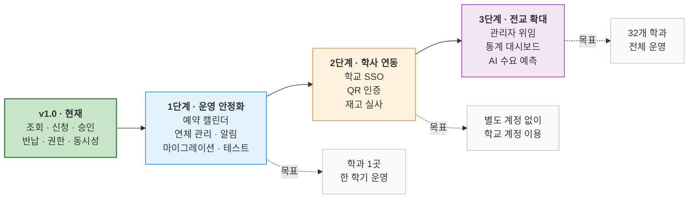

# Roadmap

현재 구현 범위와 향후 확장 계획을 기술합니다. 각 항목은 **현재 아키텍처에서 어떻게 확장 가능한지**를 함께 명시합니다.

---

## 현재 상태 (v1.0)

| 영역 | 구현 완료 |
|---|---|
| 인증 | JWT 로그인, bcrypt 해싱, 역할 기반 접근 제어 |
| 기자재 | 학과별 조회, 상세, 등록·수정(이미지 업로드) |
| 대여 | 신청, 승인, 반려, 반납, 취소 |
| 정합성 | 행 잠금 기반 동시성 제어, 상태 전이 검증 |
| 권한 | 학과 소유권 검증 |
| 운영 | 시드 데이터 자동 주입, 오프라인 시연 모드 |

**대상 범위** — 5개 학과 시드 데이터로 검증. 데이터 모델은 32개 학과 전체를 지원합니다.

---

## 단계별 계획

---

## 1단계 — 운영 안정화

**목표**: 실제 학과 한 곳에서 한 학기 운영

| 과제 | 필요성 | 구현 방향 |
|---|---|---|
| **예약 캘린더** | 현재는 수량 기반 판단만 가능. "다음 주에 빌리고 싶다"는 요구를 처리할 수 없음 | `rentals`에 이미 `start_date`·`end_date`가 있으므로, 기간 겹침 검사 쿼리 추가로 구현 가능 |
| **연체 관리** | `end_date`가 지나도 상태가 자동 변하지 않음 | 스케줄러(APScheduler 등)로 일 단위 배치 실행 → `OVERDUE` 상태 추가 |
| **알림** | 조교가 신청 여부를 직접 확인해야 함 | 이메일 또는 학교 메신저 연동. 승인·반려·반납 임박 시점 발송 |
| **마이그레이션 도구** | 현재 `create_all()` 방식은 운영 데이터 보존 불가 | Alembic 도입. 첫 마이그레이션을 현재 스키마 기준으로 생성 |
| **테스트 코드** | 재고 정합성·권한 검증에 회귀 방지 필요 | pytest + httpx. 동시 신청 시나리오를 우선 대상으로 |

**아키텍처 영향** — 예약 캘린더는 재고 판정 로직을 "현재 수량"에서 "해당 기간의 가용 수량"으로 확장해야 합니다. 신청 시점의 행 잠금 구조는 그대로 유지할 수 있습니다.

---

## 2단계 — 학사 시스템 연동

**목표**: 별도 계정 없이 학교 계정으로 이용

| 과제 | 필요성 | 구현 방향 |
|---|---|---|
| **학교 SSO 연동** | 현재는 자체 계정. 학생이 별도 비밀번호를 관리해야 함 | OAuth2/SAML 연동. `deps.py`의 `get_current_user`만 교체하면 되도록 인증 계층이 분리되어 있음 |
| **학생증 QR 인증** | 실물 수령·반납 시 본인 확인 절차 부재 | 대여 건별 QR 발급 → 조교가 스캔하여 인수·반납 확인 |
| **재고 실사** | 시스템 수량과 실물 수량의 주기적 대조 필요 | 실사 모드 화면 + 차이 발생 시 조정 이력 기록 |
| **이미지 저장소 분리** | 로컬 파일 시스템 저장은 다중 인스턴스 운영 시 문제 | S3 호환 오브젝트 스토리지로 전환. `core/storage.py`만 교체 |

**아키텍처 영향** — 인증 방식이 바뀌어도 `require_role`, 학과 소유권 검증 로직은 그대로 재사용됩니다. 인증(Authentication)과 인가(Authorization)를 분리해 둔 설계의 이점입니다.

---

## 3단계 — 전교 확대

**목표**: 32개 학과 전체 운영

| 과제 | 필요성 | 구현 방향 |
|---|---|---|
| **학과별 관리자 위임** | 32개 학과를 중앙에서 관리하는 것은 불가능 | 학과별 조교 계정 자율 관리. 현재 학과 소유권 모델이 이미 이를 전제로 설계됨 |
| **이용 통계 대시보드** | 어떤 장비가 얼마나 쓰이는지 알 수 없음 | 대여 이력 집계 — 장비별 이용률, 학과별 대여량, 평균 대여 기간 |
| **장비 예산 편성 근거** | 구매 결정이 경험에 의존 | 이용률 상위 장비, 재고 부족으로 반려된 신청 건수 → 증설 우선순위 산출 |
| **AI 수요 예측** | 학기별 수요 변동 대응 | 축적된 대여 이력 기반 시계열 예측 |
| **자연어 장비 추천** | 장비 수가 늘어나면 목록 탐색이 비효율적 | "IoT 프로젝트에 필요한 장비" 형태의 질의 → 관련 장비 추천 |

**AI 도입 시점에 관하여** — 3단계의 마지막 두 항목이 본 프로젝트에서 AI를 도입할 적절한 시점입니다. 두 문제 모두 **결정론적 로직으로 해결되지 않는 영역**이며, 충분한 데이터가 전제됩니다. 현재 단계에서 AI를 넣지 않은 판단 근거는 [AI.md](AI.md#1-핵심-결정--ai를-어디에-쓸-것인가)에 있습니다.

---

## 배포 전환

실제 도입 시 필요한 작업입니다. 현재 구조에서 **코드 수정 없이** 전환 가능하도록 설계되어 있습니다.

| 항목 | 현재 | 전환 후 |
|---|---|---|
| 실행 | 로컬 uvicorn | 교내 서버 또는 클라우드 인스턴스 |
| DB | 로컬 PostgreSQL | 관리형 DB 서비스 |
| 설정 | `.env` 파일 | 환경변수 주입 |
| CORS | 전체 허용 | 프론트엔드 도메인으로 제한 |
| `SECRET_KEY` | 개발용 값 | 안전한 랜덤 값으로 교체 |
| 이미지 | 로컬 파일 시스템 | 오브젝트 스토리지 |

> **CORS와 `SECRET_KEY`는 배포 전 반드시 변경해야 합니다.** 상세 사항은 [SECURITY.md](../SECURITY.md)를 참고하십시오.

---

## 관련 문서

- [Product.md](Product.md) — 현재 범위에서 제외한 항목과 근거
- [Architecture.md](Architecture.md) — 확장 관점에서의 구조 평가
- [SECURITY.md](../SECURITY.md) — 알려진 제약 사항
