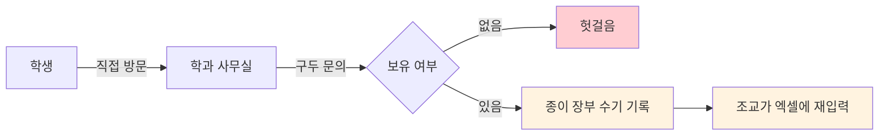
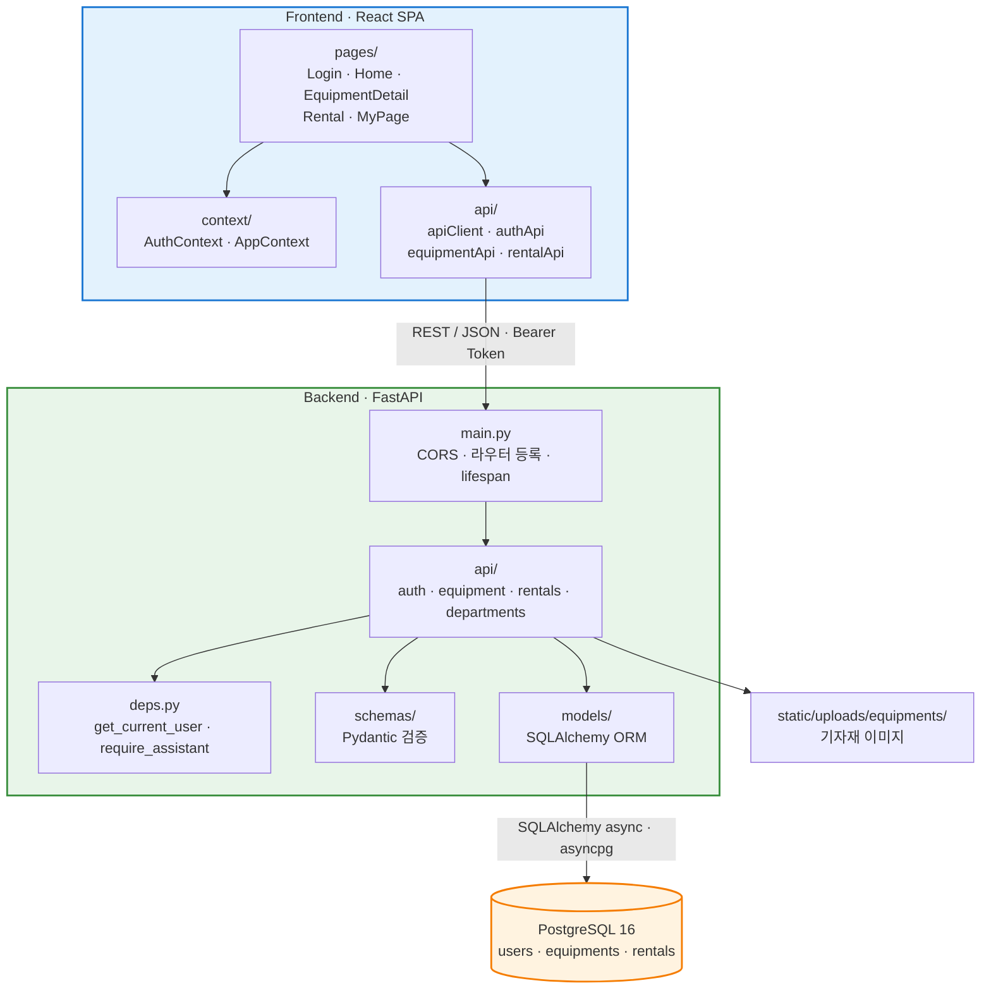
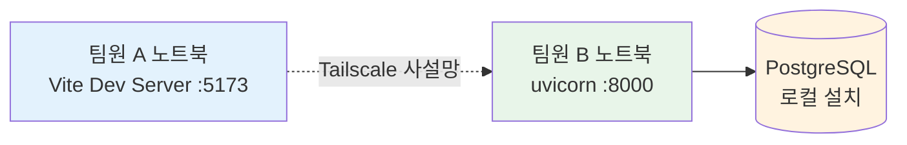
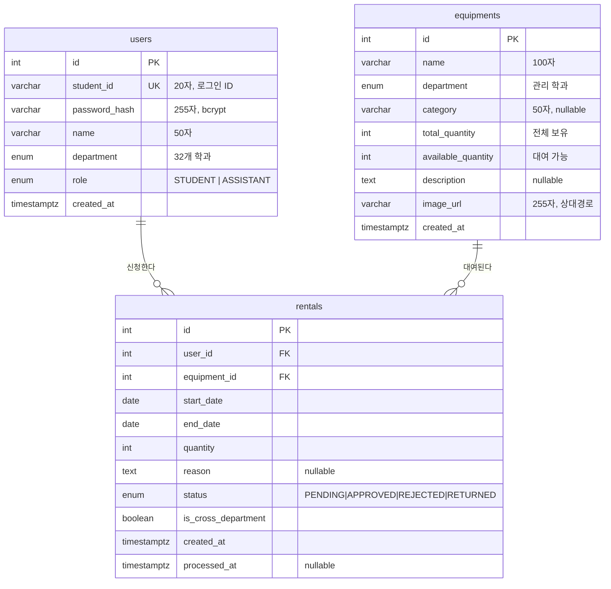
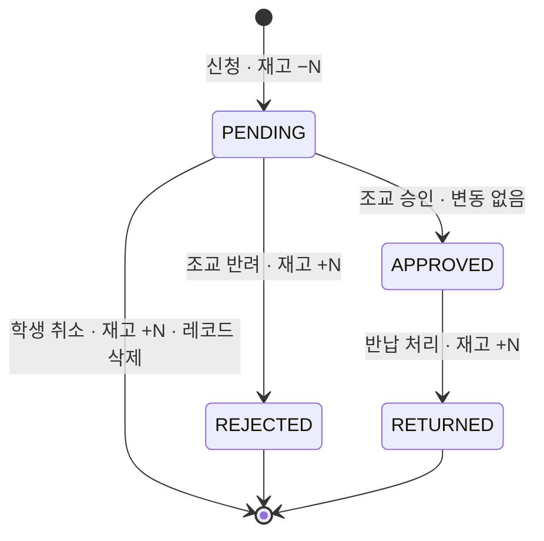
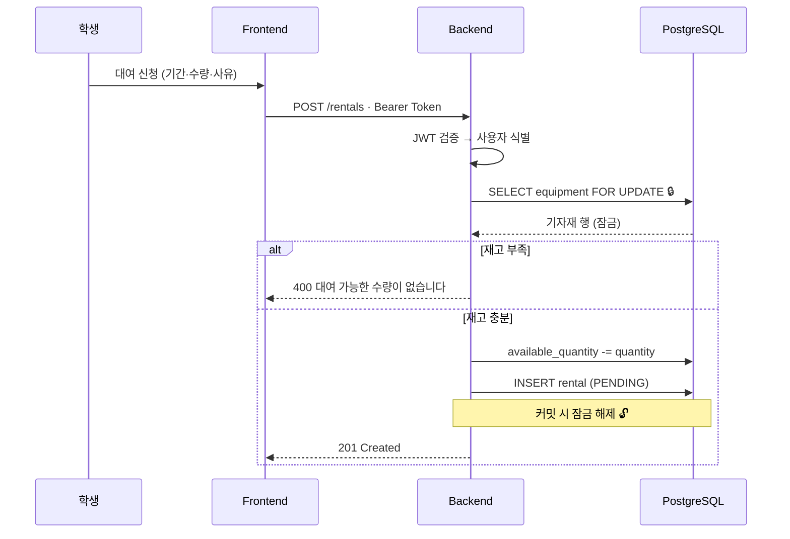
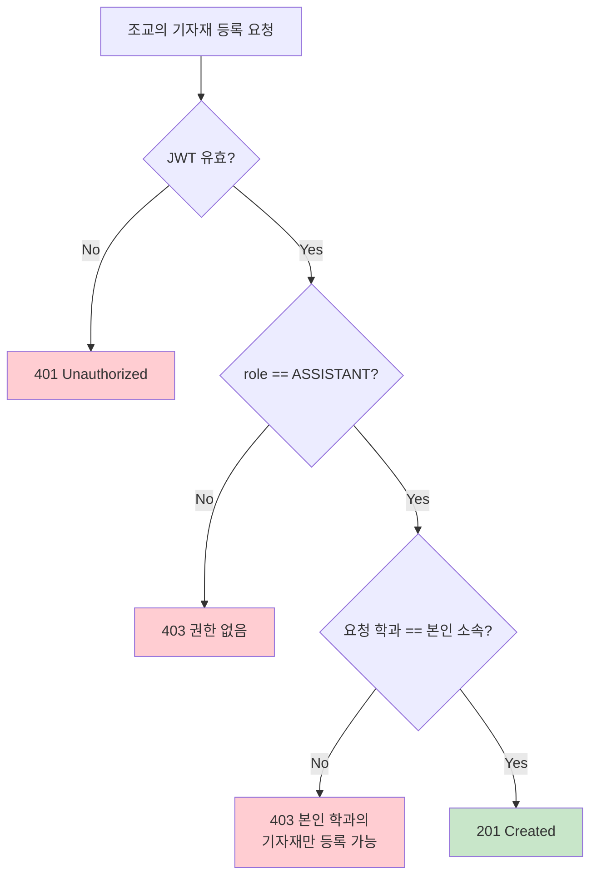
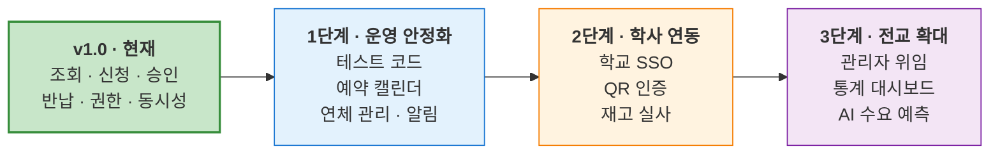

# 개발 보고서

**MJC 기자재 대여 플랫폼**

| 항목 | 내용 |
|---|---|
| 대회 | 2026학년도 교내 AI 해커톤 경진대회 |
| 팀 | 유용한 아이들 (3인) |
| 개발 기간 | 2026.08.06 ~ 08.07 (사전 기획 07.30~08.05) |
| 저장소 | https://github.com/Zman927/hackathon-useful-kids |

---

## 1. 프로젝트 개요

공학관 학과별 기자재의 **조회 · 신청 · 승인 · 반납 전 과정을 단일 웹 서비스로 통합**한 대여 관리 시스템이다.

학생은 학과별 보유 장비와 잔여 수량을 확인하고 대여를 신청하며, 조교는 본인 학과로 접수된 신청을 승인·반려하고 반납을 처리한다. 재고 수량은 신청·반려·취소·반납 각 시점에 자동 조정되므로 별도의 장부 정리가 발생하지 않는다.

**개발 결과 요약**

| 구분 | 산출물 |
|---|---|
| 백엔드 | FastAPI 서버, 15개 REST 엔드포인트, 3개 테이블 |
| 프론트엔드 | React SPA, 5개 화면, 11개 재사용 컴포넌트 |
| 인증 | JWT 기반 로그인 + 역할·학과 이중 접근 제어 |
| 초기 데이터 | 5개 학과 × (조교 1 + 학생 1 + 기자재 1) 자동 주입 |

---

## 2. 문제 정의

### 2.1 현행 절차

교내 공학관에는 32개 학과가 각자 기자재를 보유·관리한다. 대여는 다음 절차로 이루어진다.



### 2.2 도출한 문제와 대응 기능

| # | 문제 | 대상 | 대응 기능 | 구현 위치 |
|---|---|---|---|---|
| P1 | 방문 전 재고를 알 수 없어 헛걸음 발생 | 학생 | 학과별 기자재·잔여 수량 조회 | `api/equipment.py` |
| P2 | 본인 대여 이력 확인 수단 부재 | 학생 | 상태별 대여 내역 조회 | `api/rentals.py` |
| P3 | 종이 장부와 엑셀 이중 관리 | 조교 | 단일 원장 기반 승인·반납 처리 | `api/rentals.py` |
| P4 | 수기 계산으로 실물과 장부 수량 불일치 | 조교 | 상태 전이 시 재고 자동 반영 | `api/rentals.py` |
| P5 | 학과 간 관리 권한 경계 부재 | 학과 | 역할 + 학과 소유권 이중 검증 | `deps.py`, 각 라우터 |

이 문제들은 학과 수(32개)만큼 중복 발생하므로, 개별 학과의 불편이 아닌 구조적 문제로 판단했다.

---

## 3. 시스템 구성

### 3.1 전체 구조



### 3.2 실행 환경

프론트엔드와 백엔드는 각 팀원의 로컬 머신에서 실행되며, Tailscale 메시 네트워크로 통신한다. 별도 배포 환경은 구성하지 않았다.



제출물이 GitHub 저장소와 현장 시연으로 규정되어 퍼블릭 접근이 요구되지 않으므로, 클라우드 배포를 도입하지 않았다. 개발 중 사용한 환경을 시연에 그대로 사용함으로써 환경 차이로 인한 장애 요인도 제거했다.

### 3.3 데이터 모델 (ERD)



**설계 특징**

| 항목 | 설계 | 근거 |
|---|---|---|
| 학생·조교 통합 테이블 | `users`에서 `role`로 구분 | 두 역할의 속성이 동일하며, 분리 시 인증 로직이 이원화됨 |
| `available_quantity` 별도 컬럼 | 집계 계산 대신 실컬럼 관리 | 행 잠금으로 원자적 갱신이 가능해짐 |
| `is_cross_department` 저장 | 계산 가능한 값을 신청 시점에 기록 | 이후 사용자 소속이 변경되어도 신청 당시 사실을 보존 |
| 학과 마스터 | DB 테이블이 아닌 `models/departments.py` 상수 | 변경 빈도가 극히 낮고, Enum 제약으로 무결성 확보 |

---

## 4. 기술 스택 및 선정 이유

| 영역 | 기술 | 선정 이유 |
|---|---|---|
| Frontend | React 18 + Vite | 팀 내 경험 보유. HMR로 1.5일 개발 기간에 반복 속도 확보 |
| | React Router v6 | SPA 라우팅 표준 |
| | Context API | 전역 상태가 인증 정보 중심으로 규모가 작아 외부 상태 관리 라이브러리는 과설계로 판단 |
| | Tailwind CSS | 별도 CSS 파일 없이 일관된 스타일 유지 |
| Backend | FastAPI | 타입 힌트 기반 자동 검증과 `/docs` 자동 생성으로 문서화 비용 절감 |
| | SQLAlchemy 2.x (async) | `asyncpg` 비동기 I/O, `Mapped[]` 최신 타입 어노테이션 |
| | Pydantic v2 | 잘못된 입력을 라우터 진입 전 차단 |
| DB | **PostgreSQL 16** | **`SELECT ... FOR UPDATE` 행 잠금이 요구사항.** SQLite로는 재고 동시성 제어 불가 |
| Auth | JWT(python-jose) + bcrypt | 무상태 인증으로 서버 세션 저장소 불필요 |
| Network | Tailscale | 물리적 네트워크와 무관한 팀원 간 직접 통신 |

### 제외한 기술과 판단 근거

| 제외 대상 | 근거 |
|---|---|
| Docker / Compose | 팀 3인, 기간 1.5일. 컨테이너 환경 구축 비용이 네이티브 설치 대비 이득을 초과 |
| 클라우드 배포 | 제출 형태상 퍼블릭 접근이 불필요. 설정·장애 대응 부담만 발생 |
| API 버저닝(`/v1`) | 단일 버전으로 종료되는 프로젝트에서 불필요한 추상화 계층 |
| CI/CD | 배포 대상이 없어 파이프라인이 검증할 산출물이 부재 |
| 인앱 LLM | 6장 참고 — 결정론적 정합성이 요구되는 도메인 |

---

## 5. 핵심 기능

### 5.1 기능 목록

**학생**

| 기능 | 엔드포인트 | 비고 |
|---|---|---|
| 학과별 기자재 조회 | `GET /equipment?department_id=` | 잔여 수량 포함 |
| 기자재 상세 | `GET /equipment/{id}` | |
| 대여 신청 | `POST /rentals` | 기간·수량·사유 입력, 신청 즉시 재고 차감 |
| 내 대여 내역 | `GET /rentals` | 본인 건만 최신순 |
| 신청 취소 | `POST /rentals/{id}/cancel` | `PENDING` 상태만, 재고 복원 |

**조교** (학생 권한 포함)

| 기능 | 엔드포인트 | 비고 |
|---|---|---|
| 학과 대여 현황 | `GET /rentals/all` | 본인 학과 기자재 건만 |
| 승인 | `POST /rentals/{id}/approve` | 재고 변동 없음 |
| 반려 | `POST /rentals/{id}/reject` | 재고 복원 |
| 반납 처리 | `POST /rentals/{id}/return` | 재고 복원 |
| 기자재 등록 | `POST /equipment` | 이미지 업로드 포함 |
| 기자재 수정 | `PATCH /equipment/{id}` | |

### 5.2 재고 생애주기

재고는 **신청 시점에 차감**되며, 흐름이 종료되는 모든 경로에서 복원된다. 승인 대기 중인 신청도 재고를 점유하므로, 아직 처리되지 않은 장비가 다른 학생에게 이중 배정되지 않는다.



### 5.3 대여 신청 처리 흐름



### 5.4 접근 제어

역할(Role)만으로 통제하면 "조교라면 아무 학과 기자재나 관리 가능"이라는 결함이 발생한다. 권한과 소유권을 **별개 관심사로 분리 검증**한다.



동일한 소유권 검증이 승인·반려·반납에도 적용된다 (`api/rentals.py`의 `_get_own_department_rental_or_404`).

---

## 6. 개발 과정에서의 AI 활용

본 프로젝트는 **AI를 서비스 런타임 기능이 아니라 개발 프로세스의 도구로 활용**했다. 코드베이스에 LLM API 호출은 존재하지 않는다.

### 6.1 인앱 AI를 배제한 판단

기자재 대여의 핵심 요구사항은 **재고 정합성 · 권한 경계 · 상태 전이의 정확성** 세 가지이며, 모두 결정론적으로 동작해야 하는 영역이다. "이 장비가 몇 개 남았는가"는 DB가 정확히 답할 수 있고 정확해야만 하는 질문이므로, 확률적 출력을 개입시킬 이유가 없다고 판단했다.

또한 사용자 여정이 `학과 선택 → 장비 선택 → 날짜·수량 입력 → 신청`으로 각 단계가 명확한 선택지를 가져, 자연어 인터페이스를 도입하면 클릭 3회로 끝날 작업이 대화 5턴으로 늘어난다.

### 6.2 단계별 활용

| 단계 | 활용 방식 | 산출물 |
|---|---|---|
| 문제 정의 | 아이디어를 5개 검증 질문으로 구조화 | 문제 P1~P5 도출 |
| 설계 | 코드 작성 전 REST API 계약 확정 | 프론트/백엔드 병렬 개발 착수 |
| 구현 | 미숙한 스택(SQLAlchemy 2.x async, JWT)의 최신 관용구 적용 | 백엔드 API, 프론트 컴포넌트 |
| **품질 검증** | **적대적 코드 리뷰** | **결함 6건 발견·수정** |
| 문서화 | 코드 기준 문서 정합성 검증 | 저장소 문서 일체 |

### 6.3 가장 큰 성과 — 적대적 코드 리뷰

3인 팀에서 2명이 개발을 담당하는 구조상 상호 코드 리뷰가 불가능했다. 이 공백을 "이 코드가 잘 작성되었는가"가 아니라 **"이 코드를 어떻게 깨뜨릴 수 있는가"** 를 묻는 방식의 AI 리뷰로 보완했다.

| # | 발견한 결함 | 조치 |
|---|---|---|
| 1 | CORS 명세 위반 — `allow_origins=["*"]` + `allow_credentials=True` | Bearer 인증이므로 `credentials=False`로 변경 |
| 2 | 조교가 **타 학과 기자재 등록 가능** (역할만 검사) | 학과 소유권 검증 추가 |
| 3 | 재고 차감 **레이스 컨디션** | `SELECT ... FOR UPDATE` 적용 |
| 4 | 반납 엔드포인트 부재 — `APPROVED` 상태 미종결 | `POST /rentals/{id}/return` 신규 구현 |
| 5 | 이미지 절대 URL 저장 — 서버 IP 변경 시 데이터 무효화 | 상대 경로 저장 + 응답 시 결합 |
| 6 | `login`과 `/me`의 `role` 값 불일치 | `ROLE_TO_FRONTEND` 매핑 단일화 |

**2번과 3번은 시연 중에는 드러나지 않는 결함**이다. 한 사람이 순차 조작하는 데모에서는 동시 요청도 타 학과 접근도 발생하지 않는다. 적대적 관점의 검토가 없었다면 코드에 남았을 것이다. (커밋 `e27244d`)

### 6.4 AI 활용의 한계

| 한계 | 실제 사례 | 대응 |
|---|---|---|
| 컨텍스트 불일치 | 브랜치별 세션이 서로 다른 구조를 가정 | API 계약을 저장소 문서로 고정 |
| 그럴듯한 오답 | 존재하지 않는 경로·함수명을 사실처럼 제시 | 수정 후 반드시 문법 검증 및 실행 확인 |
| 과설계 경향 | 요청하지 않은 추상화 계층 제안 | 프로젝트 규모 기준으로 취사 선택 |

AI 산출물은 **검증 대상이지 신뢰 대상이 아니라는 것**이 핵심 교훈이었다.

---

## 7. 기술적 어려움과 해결 과정

### 7.1 재고 차감 시 경쟁 조건

**문제** — 여러 학생이 마지막 남은 장비를 동시에 신청하면, `조회 → 검사 → 차감` 순서에서 두 요청 모두 "빌릴 수 있다"고 판단해 재고가 음수가 된다.

**해결** — 기자재 행을 잠근 뒤 재고를 확인·차감하도록 변경했다.

```python
# backend/app/api/rentals.py
equipment_result = await db.execute(
    select(Equipment).where(Equipment.id == payload.equipment_id).with_for_update()
)
```

먼저 도착한 트랜잭션이 커밋할 때까지 뒤따른 요청이 대기하므로, 두 번째 요청은 갱신된 재고(0)를 읽어 정상적으로 400을 반환한다. **이 요구사항 때문에 DB를 SQLite가 아닌 PostgreSQL로 선정**했다.

### 7.2 권한 검증의 불완전성

**문제** — 초기 구현은 `require_assistant`로 역할만 확인했다. 컴퓨터공학과 조교가 전자공학과 기자재를 등록하거나 그 학과의 대여 신청을 승인할 수 있었다.

**해결** — 역할 검증 이후 소유권을 추가 검증하는 계층을 두었다.

```python
# backend/app/api/equipment.py
if department != current_user.department:
    raise HTTPException(status_code=403, detail="본인 학과의 기자재만 등록할 수 있습니다.")
```

대여 처리 경로에는 `_get_own_department_rental_or_404` 헬퍼를 두어 승인·반려·반납 세 곳에서 동일 검증을 재사용한다.

### 7.3 파일 업로드 검증

**문제** — 클라이언트가 보내는 `Content-Type` 헤더는 위조 가능하므로, MIME 타입만으로는 실행 파일을 이미지로 위장한 업로드를 막을 수 없다.

**해결** — 3단 검증을 적용했다 (`core/storage.py`).

| 단계 | 검증 |
|---|---|
| 1 | `Content-Type`이 허용 목록(jpeg/png/webp/gif)에 있는가 |
| 2 | 청크 단위로 읽으며 5MB 초과 시 즉시 중단 |
| 3 | **매직 바이트 검사** — 파일 시그니처가 실제 이미지 형식과 일치하는가 |

```python
IMAGE_SIGNATURES = (b"\xff\xd8\xff", b"\x89PNG\r\n\x1a\n", b"GIF87a", b"GIF89a")
# WEBP는 "RIFF????WEBP" 구조로 별도 판별
```

저장 파일명은 `uuid4`로 생성해 경로 조작과 파일명 충돌을 함께 차단했다.

### 7.4 서버 주소 변경 시 이미지 URL 무효화

**문제** — Tailscale IP는 환경에 따라 달라진다. 이미지 절대 URL을 DB에 저장하면 주소가 바뀔 때마다 전체 레코드를 갱신해야 한다.

**해결** — DB에는 상대 경로만 저장하고, 응답 시 요청의 `base_url`을 결합해 절대 URL로 변환한다.

```python
# backend/app/schemas/equipment.py
if image_url and image_url.startswith("/"):
    image_url = base_url.rstrip("/") + image_url
```

### 7.5 세션 만료 시 UI 불일치

**문제** — JWT가 만료되어도 프론트엔드는 `localStorage`의 사용자 정보를 근거로 로그인 상태를 유지해, 모든 요청이 실패하는데도 화면은 정상으로 보였다.

**해결** — `apiClient.js`에서 **토큰을 실어 보낸 요청이 401을 받은 경우**에만 세션을 정리하고 커스텀 이벤트를 발행하도록 했다. 로그인 요청의 401(자격 증명 오류)과 구분하기 위함이다.

```javascript
if (response.status === 401 && token) {
  localStorage.removeItem(AUTH_STORAGE_KEY);
  window.dispatchEvent(new Event("auth:expired"));
}
```

`AuthContext`가 이 이벤트를 수신해 상태를 초기화하고 사용자에게 안내한다.

### 7.6 3인 병렬 개발의 통합 문제

**문제** — 프론트엔드와 백엔드가 각자 브랜치에서 진행하면서 폴더 구조와 환경변수명이 어긋났다. 실제로 `VITE_API_BASE`와 `VITE_API_BASE_URL`이 혼용되었고, 백엔드 라우터 위치가 문서(`api/`)와 코드(`routers/`)에서 달랐다.

**해결**

| 조치 | 내용 |
|---|---|
| API 계약 선확정 | 코드 작성 전 엔드포인트·스키마·상태값을 문서로 고정 |
| 구조 통일 | `routers/` → `api/`, `config.py`·`database.py` → `core/`로 이동 후 import 경로 일괄 수정 |
| 정합성 검증 | 문서에 기재된 엔드포인트·컬럼·환경변수명이 코드와 일치하는지 대조 |

### 7.7 도메인 용어와 UI 용어의 불일치

**문제** — DB는 `ASSISTANT`/`PENDING` 같은 도메인 용어를, 프론트엔드는 `admin`/`pending` 같은 UI 관례를 사용한다. 변환이 여러 곳에 흩어지면 불일치가 발생한다.

**해결** — 변환 매핑을 스키마 계층 한 곳에 집중시켰다.

```python
# schemas/user.py
ROLE_TO_FRONTEND = {Role.ASSISTANT: "admin", Role.STUDENT: "student"}
# schemas/rental.py
STATUS_TO_FRONTEND = {"PENDING": "pending", "APPROVED": "rented", ...}
```

표현 계층이 바뀌어도 도메인 모델은 영향을 받지 않는다.

---

## 8. 테스트 및 검증

### 8.1 검증 방식

**자동화된 테스트 코드는 작성하지 못했다.** 개발 기간 1.5일 내에 기능 구현을 우선했기 때문이며, 이는 본 프로젝트의 명확한 한계다. 검증은 아래 수단으로 수행했다.

| 방식 | 내용 |
|---|---|
| 정적 검증 | 백엔드 전체 Python 파일 문법 검증(`ast.parse`), 프론트엔드 `npm run build` |
| 스키마 검증 | Pydantic v2가 요청 단계에서 타입·제약을 자동 차단 |
| API 단위 확인 | FastAPI 자동 생성 문서(`/docs`)에서 각 엔드포인트 직접 호출 |
| 통합 시나리오 | 학생 신청 → 조교 승인 → 반납까지 수동 실행 |
| 적대적 리뷰 | AI 기반 코드 리뷰로 결함 6건 발견 (6.3 참고) |

### 8.2 입력 검증 구현

Pydantic 모델 수준에서 잘못된 입력을 차단한다 (`schemas/rental.py`).

```python
@field_validator("quantity")
def validate_quantity(cls, value: int) -> int:
    if value < 1:
        raise ValueError("quantity는 1 이상이어야 합니다.")

@model_validator(mode="after")
def validate_dates(self):
    if self.end_date < self.start_date:
        raise ValueError("end_date는 start_date보다 빠를 수 없습니다.")
```

### 8.3 통합 검증 시나리오

시드 데이터 기준으로 다음 순서를 반복 실행해 확인했다.

| # | 단계 | 기대 결과 | 결과 |
|---|---|---|---|
| 1 | `2026001` / `pwd123` 로그인 | 토큰 발급, 홈 진입 | ✅ |
| 2 | 컴퓨터공학과 선택 | 라즈베리 파이 4 (잔여 5) 표시 | ✅ |
| 3 | 대여 신청 (수량 1) | 잔여 4, 상태 `심사중` | ✅ |
| 4 | `com` / `pwd123` 로그인 | 조교 대시보드 표시 | ✅ |
| 5 | 신청 승인 | 상태 `대여중`, 잔여 4 유지 | ✅ |
| 6 | 반납 처리 | 상태 `반납완료`, 잔여 5 복원 | ✅ |
| 7 | 학생 계정으로 기자재 등록 시도 | 403 반환 | ✅ |
| 8 | 타 학과 기자재 등록 시도 | 403 반환 | ✅ |

### 8.4 시연 안정성 확보

현장 네트워크 장애에 대비해 **목업 모드**를 구현했다. `VITE_USE_MOCK=true` 설정 시 백엔드 없이 목업 데이터로 전체 사용자 흐름을 시연할 수 있다 (`frontend/src/api/mockData.js`).

### 8.5 검증되지 않은 영역

정직하게 기록한다.

| 영역 | 상태 |
|---|---|
| 자동화 테스트 | 미작성 |
| 동시성 제어 실측 | 코드상 행 잠금은 적용했으나, 다중 클라이언트 동시 요청 부하 테스트는 미수행 |
| 브라우저 호환성 | Chrome 계열에서만 확인 |
| 대용량 데이터 | 시드 수준(기자재 5건)에서만 검증 |

---

## 9. 기대 효과

### 9.1 학생

| 항목 | 개선 |
|---|---|
| 헛걸음 제거 | 방문 전 잔여 수량 확인 가능 (P1) |
| 이력 관리 | 본인 대여 내역을 상태별로 조회 (P2) |
| 접근성 | 사무실 운영 시간과 무관하게 신청 가능 |

### 9.2 조교

| 항목 | 개선 |
|---|---|
| 이중 관리 해소 | 종이 장부 + 엑셀 → 단일 원장 (P3) |
| 재고 정확도 | 상태 전이 시 자동 반영으로 수기 계산 오류 제거 (P4) |
| 신청 처리 | 대시보드에서 목록 확인 및 일괄 처리 |

### 9.3 학과·학교

| 항목 | 개선 |
|---|---|
| 권한 경계 | 학과별 관리 범위가 시스템으로 강제됨 (P5) |
| 확장성 | 32개 학과 전체를 코드 수정 없이 수용 (마스터 데이터 분리) |
| 데이터 축적 | 대여 이력이 구조화되어 향후 통계·예산 편성 근거로 활용 가능 |

---

## 10. 향후 발전 방향



### 1단계 — 운영 안정화 (학과 1곳 도입)

| 과제 | 필요성 | 구현 방향 |
|---|---|---|
| **테스트 코드** | 현재 가장 시급한 부채. 재고·권한 로직의 회귀 방지 필요 | pytest + httpx, 동시 신청 시나리오 우선 |
| 예약 캘린더 | 현재는 수량 기반 판단만 가능 | `rentals`에 `start_date`·`end_date`가 이미 있어 기간 겹침 검사 추가로 구현 가능 |
| 연체 관리 | `end_date` 경과 시 상태가 자동 변하지 않음 | 스케줄러 배치로 `OVERDUE` 상태 추가 |
| 알림 | 조교가 신청을 직접 확인해야 함 | 이메일·메신저 연동 |
| 마이그레이션 도구 | `create_all()` 방식은 운영 데이터 보존 불가 | Alembic 도입 |

### 2단계 — 학사 시스템 연동

| 과제 | 구현 방향 |
|---|---|
| 학교 SSO | `deps.py`의 `get_current_user`만 교체하면 되도록 인증 계층이 분리되어 있음 |
| 학생증 QR 인증 | 대여 건별 QR 발급 → 실물 인수·반납 확인 |
| 이미지 저장소 분리 | 다중 인스턴스 운영 대비. `core/storage.py`만 교체 |

### 3단계 — 전교 확대 (32개 학과)

| 과제 | 구현 방향 |
|---|---|
| 학과별 관리자 위임 | 현재 학과 소유권 모델이 이미 이를 전제로 설계됨 |
| 이용 통계 대시보드 | 장비별 이용률, 학과별 대여량, 평균 대여 기간 |
| 예산 편성 근거 | 재고 부족으로 반려된 신청 건수 → 증설 우선순위 산출 |
| **AI 수요 예측 · 자연어 장비 추천** | 두 문제 모두 결정론적 로직으로 해결되지 않는 영역이며, 축적된 데이터가 전제됨. **이 시점이 본 프로젝트에 AI를 도입할 적절한 단계** |

### 배포 전 필수 조치

실제 도입 시 아래는 반드시 변경해야 한다.

| 항목 | 현재 | 조치 |
|---|---|---|
| `SECRET_KEY` | 개발용 플레이스홀더 | 충분한 엔트로피의 랜덤 값 |
| CORS | `allow_origins=["*"]` | 프론트엔드 도메인으로 제한 |
| 통신 | HTTP (Tailscale 사설망 의존) | TLS 적용 |
| 비밀번호 | 시드 계정 공통 `pwd123` | 복잡도 규칙 및 초기 변경 강제 |
| Rate Limiting | 없음 | 로그인 엔드포인트 시도 제한 |

---

## 부록 — 저장소 구조

```
backend/app/
├── api/          라우터 (auth · equipment · rentals · departments)
├── core/         config · database · security · storage
├── models/       SQLAlchemy ORM (user · equipment · rental · enums · departments)
├── schemas/      Pydantic 스키마 (auth · user · equipment · rental)
├── deps.py       인증 · RBAC 의존성
├── init_db.py    시드 데이터
└── main.py       앱 진입점 · CORS · 라우터 등록

frontend/src/
├── api/          apiClient · authApi · equipmentApi · rentalApi · mockData
├── components/   common · equipment · layout · rental
├── context/      AuthContext · AppContext
├── pages/        Login · Home · EquipmentDetail · Rental · MyPage
└── App.jsx       라우팅
```

---

**팀 유용한 아이들** · 2026학년도 AI 해커톤 경진대회
